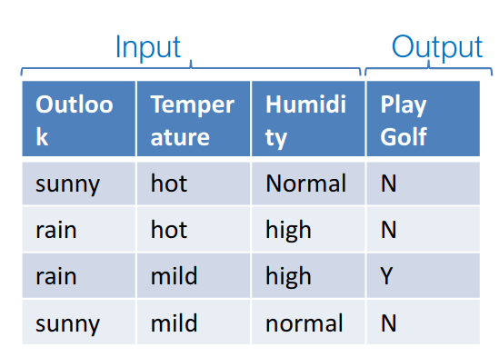
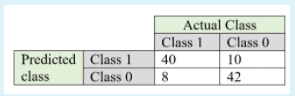
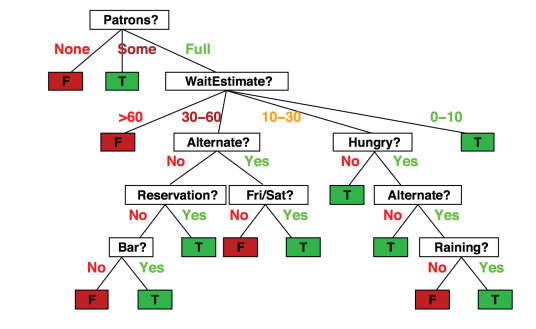

# COMP4900: Intro to Machine Learning
## The Language of Machine Learning
### Unsupervised
- Types of unsupervised machine learning include generative modeling, clustering, and anomaly detection.
#### Clustering
- Organizing data into clusters. Inferring distances between data points.
### Supervised
- Types of supervised machine learning include regression and classification.
#### Classification
- Predicts a finite categorical value belonging to a discrete set. (See Assignment 1, if the patient had hepatitis or didn't.)
#### Regression
- Predict a real continuous output value. Using the - features, predict the future result. 
##### QUIZ QUESTIONS
###### 1. Which of these evaluation metrics are appropriate for regression tasks?
- **a. Mean squared error** 
- b. Area under the ROC curve
- c. F-Score
- **d. Root mean squared error** 
- **e. Mean absolute error** 
###### 2. What is the main difference between regression and classification?
- **a. In regression a continuous value is predicted while for classification discrete classes are predicted** 
- b. In classification the class labels are given while for regression there are no labels for training data
- c. In classification a continuous value is predicted while for regression discrete classes are predicted
- d. In regression the class labels are given while for classification there are no labels for training data
### Variables
- Columns are called - variables or features or attributes.
### Output Variables
- Output variables / targets are the columns we are trying to predict. 
### Training example
- A row in the table is the training example / instance.
### Datasets
- The whole table containing all the training examples is the data set.
### Variable types
- Numerical: Real number measurements (Quantitative). 
- Categorical: From a discrete set (Qualitative)
- Ordinal: Categorical attributes that are ordered, allows ranking. (E.g: First, second, third)
### i.i.d assumption
- The independent and identically distributed assumption indicates that your data is independent and identically distributed. In supervised learning, the examples Xi in the training set are assumed to be independent and identically distributed.
- Independent: Every Xi is sampled according to some probability distribution D over the data domain X. For example, in an IQ study, if we measure an individual's IQ, it shouldn't provide any information about the next subject assessed. 
- Identically distributed: The distribution D is the same for all examples. One probability distribution should adequately model all values you observe in a sample. It is vital that the data is identically distributed as it indicates that you are are assessing a stable phenomenon. Example: If you are measuring the strength of a product and the mean strength increases as you collect more samples, it's hard to draw a conclusion. The mean strength depends on when you measure it. 
#### How to assess i.i.d in your dataset: 
- Independence: Consider how the data was collected for the data set. Was it randomly sampled or was it obtained in another way that would cause the information to be related to one another?
- Identical Distribution: Determine if there are any trends, graph the data in the order it was measured and look for patterns.
### Empiricial risk minimization
- Example for Explanation:
    - Problem: A simple supervised learning classification problem designed to classify spam emails. 
    - Each email has a label 0 (not spam) or 1 (spam). We denote the - variables with X and the output variable with Y.
    - The function f: X -> Y maps the - variables to the output variable.
    - Now that the problem has been defined, we need a model that is going to make our predictions. A synonym for model is the hypothesis H. The hypothesis is a function that takes - from X and produces an output label 0 or 1. This function h: X -> Y.
    - We want to find the hypothesis that minimizes our error, with this we come to the term empirical risk minimization. The term empirical implies that we minimize our error based on a sample set S from the domain set X.
    - Say we sample S from X, True error is based on the whole - X, however we only have access to S, a subset of X, we learn based on that sample of training examples. We don't have access to the true error, but to the empirical error.
    - The empirical error is also called generalisation error. In most problems, we don't have access to the whole X, instead S. We want to generalised based on S. This error is also called the risk. 
    - Since we have only S, it happens that we minimize the empirical error, but increase the true error. 
## Linear regression 
- The linear regression problem: : fw(xi) = w0 + ∑j=1:m Wj Xi,j where m is the number of features.
- The goal of linear regression is to find the best linear model given the training data. 
- Most common choice is to find the w that minimizes Err(w) (see Least Squares solution for this equation.)
##### QUIZ QUESTIONS
###### 1. In linear regression, why do we add a column of all 1's to the input matrix X?
- a. To account for the missing values
- **b. To simplify the notations and implementation using matrix operations** 
- c. To be able to calculate the error value
- d. To speed up the calculations
    - The correct answer is: B. To simplify the notations and implementation using matrix operations
###### 2. Consider a simple linear regression model with one independent variable x. The output variable is y. The model is y=w1x+w0, where w1 is the slope and w0 is the intercept. If we change the input variable x by 1 unit, by how much output variable y will change?
- a. Slope + intercept
- b. intercept
- c. 1
- **d. Slope**
    - y2−y1=(w1(x+1)+w0)−(w1(x)+w0)=w1, so the correct answer is slope.
### Least squares solution
- Find the best linear model given the data. 
- Most common choice is to find the w that minimizes squared error
    - Err(w) =  ∑ i=1:n (Yi - w^T Xi)^2
    - Goal is to find a function in the form Fw(x) = w^T X
    - W is calculated such that the sum of squared error is minimized.
    - w = argmin ∑ i=1:n (Yi - w^T Xi)^2
    - Yi (True target value)
    - w^T Xi (Predicted value for the target using the linear model and - variables.)
- Notation:
    - X is the n x m matrix of - data
    - Y is the n x 1 vector of output data
    - W is the m x 1 vector of weights
    - Fw(X) is the n x 1 vector of the predicted values
    - Err(w) is a scaler
    - In matrix notation
        - Fw(X) = X * w
        - Err(W) = (y - X * w)^T (y -  X * w)
    - wHat denotes the estimated weights that minimizes the error we defined.
    - 𝜕Err(W)/𝜕w = -2X^T (y - X * w)
    - X^T (y - X * w) = 0
    - X^T * y - X^T * w = 0
    - wHat = (X^T * X)^-1 * (X^T * y)
    - Best Fitted model: yHat = X * wHat
### Predicting new data
- To predict the outcome of new data Xnew -> Ynew
- yHatNew = Xnew * wHat
### Gradient Descent
- Gradient descent is an iterative optimisation algorithm to find the minimum of a function.
- We want to produce a sequence of weight solutions w0,w1,w2,..., such that: Err(W0) > Err(W1) > Err(W2) > ...
- The algorithm: 
    - Given an initial weight vector w0,
    - Do for k = 0,1,2,...
        - calculate Z = 𝜕Err(Wk)/𝜕Wk
        - Wk+1 = Wk - Ak * Z (Take a step in the negative direction specified by the gradient)
    - End when || Wk+1 - Wk || < E
- Parameter Ak > 0 is the step size (or learning rate) for iteration k.
- Gradient descent steps down the function the direction of the steepest descent. The size of each step is determined the learning rater.
- In the gradient descent algorithm, one can infer that...
    - If the slope is positive, the value of the weights of the hypothesis decreases.
    - If the slope is negative, the value of the weights of the hypothesis increases.
- Failure in gradient descent. 
    - If Ak is too large, the gradient descent can overshoot the minimum and fail to converge or diverge.
    - If Ak is too small, the gradient descent will take small steps to reach the local minima and it will take a long time.
### Failure modes
#### Avoid Singularities
- The weights are not uniquely defined. Example: One feature is a linear function of the other. Solved by re-coding or dropping redundant columns of X.
- The number of features (m) exceeds the number of training examples (n). Solved by reducing the number of features using various techniques. 
### Bad fits
- Linear regression can be a bad fit in some cases.
- In order to improve the fit...
    - Pick a better function
    - Use more features
    - Get more data.
### Variables for linear regression
- Original quantitative variables: X1,..., Xm
- Transformations of variables: e.g Xm+1 = log(Xi)
- Basis expansions: e.g. Xm+1 = Xi^2, Xm+2 = Xi^3
- Interaction terms: e.g. Xm+1 = XiXj
- In all cases, we can add Xm+1,...,Xm+k to the list of original variables and perform the linear regression.
### Order-nth fit
- Order-1 polynomial: Ex: y = 1.6x + 1.05
- Order-2 polynomial: Ex: y = 0.68x^2 + 1.74x + 0.73
- Constructing a curve that has the best fit to a series of data points, subject to constraints. The n value is the number of points to which the curve will be fitted. 
### Overfitting/Generalisation
- We can find a model that explains perfectly, the training data, but does not generalise well to new data.
#### Overfitting: 
- We can do really well in the training data, but it doesn't generalise to unseen data. We don't want to just minimize error on the training set. We want to minimize the true error and develop models that generalise well to unseen data. 
- Every model has a true error measured on all possible data items we could ever encounter, but we don't have all possible data. In order to decide what is a good model, we measure error over the training set. 
- Example: Suppose we compare 2 models F and G trained using the same algorithm, assume F has a lower error on the training set and G has lower true error, then our algorithm is overfitting.
#### Generalisation:
- In ML, our goal is to develop models that generalise.
- Overly simple model:
    - High training error and high test error.
- Overly complex model:
    - Low training error but high test error.
### Uses of data
- Paritioning the data into 3 sets help to evaluate the data.
#### Training set
- Used to fit a model (find the best hypothesis in the class; learn parameters)
##### QUIZ QUESTIONS:
######  1. Consider the following training set of 3 training examples. 
    x	       y
    1	       3
    3	       4
    7	       6
###### Consider the linear regression model y=w1x+w0. What are the values of w1 and w0 that you would expect to obtain upon running gradient descent on this model? Can the linear regression fit this data perfectly (i.e. zero error)?
- a. w1 = 0.5, w0 =2.5, No
- b. w1 = 1, w0 =1.5, Yes
- **c. w1 = 0.5, w0 =2.5, Yes**
- d. w1 = 1, w0 =1.5, No
    - You can verify that all points are located on y=w1x+w0
######  2. Why do we usually assume training samples are independently drawn from a latent distribution?
- a. It is a good approximation of the real distribution of the population 
- b. Since it is true most of the time
- **c. Since it makes our model simple**
- d. It is a mathematical fact about all populations
#### Validation set
- Used for model selection, i.e., to estimate true error and compare hypothesis classes. (E.g., compare different order polynomials). 
- Validation set is used to compare different models during development.
    - Compare hypothesis/model classes. E.g., should I use a first- or second-order polynomial fit?
- Compare hyperparameters (i.e., a parameter that is not learned but that could impact performance). E.g., what learning rate should I use?
#### Test set
- What you report the final accuracy on.
### K-fold cross validation
- Instead of just one validation set, we can evaluate on many splits!
    - Consider k partitions of the training/non-test data (usually of equal size).
    - Train with k-1 subsets, validate on kth subset. Repeat k times.
    - Average the prediction error over the k rounds/folds.
##### QUIZ QUESTIONS:
######  1. In k-fold cross-validation on a set of n data points, on how many points the error function is evaluated?
- a k data points
- b. nk data points 
- **c. n data points**
- d. n/k data points
    - In k-fold cross-validation, each sample is tested once --i.e. n/k samples are tested per fold. The correct answers are: n data points, n/k data points
### Cross validation for comparing models
- Say we have 2 models and this is a 5-fold cross validation
- Model/hypothesis A: Linear regression with basic features 
    - ErrA = 1/5 ∑j=1:5 Err^A_I (Average error of model A across all folds.)
- Model/hypothesis B: Linear regression with quadratic expansions of features
    - ErrB = 1/5 ∑j=1:5 Err^B_I (Average error of model B across all folds.)
- If ErrA < ErrB then we should use Model A, we should use a linear regression model with basic features.  
- Then to get the final Model A weights, we train on the entire dataset, ignoring the cross validation folds.
### Leave one out cross validation
- Let k = n, the size of the training set
- For each model / hyperparameter setting,
    - Repeat n times:
        - Set aside one instance (xi, yi) from the training set.
        - Use all other data points to find w (optimization).
        - Measure prediction error on the held-out (xi, yi).
    - Average the prediction error over all n subsets.
- Choose the setting with lowest estimated true prediction error.

## Linear Classification
### Classification Problems
- Y is a finite discrete set
- Given data set D = (Xi, Yi), with Yi, find a hypothesis which best fits the data.
    - If Yi = (0,1), this is a binary classification.
    - If Yi can take more than two values, the problems is called multi-class classifications.
### Classification via linear regression
- Example: A tumor classifier.
    - -: X - Tumor size
    - Binary output:
        - Y = {No recurrence = 0; Recurrence = 1}
    - yHatn = Xn (X^T * X)^-1 * X^T * Y
    - How to get a binary output?
        - Threshold: If yHat > threshold then norecurrence class, if yHat <= then Recurrence class.
        - Interpret output as probability: yHat = Probability (Recurrence)
### Probabilistic 
- Estimate P(y | x), the conditional probability of the target variable given the feature data.
### Discriminative Learning
- Partition the feature space into different regions, and classify points based on the region where they lie.
## Logistic Regression
##### QUIZ QUESTION
###### 1. Consider a logistic regression model for a binary classification problem. The log-odd ratio for a test sample x is -3. What is P(y=0|x) ?
- **Answer: ln(p1/(1-p1))=-3  --> p1/(1-p1)=exp(-3)=0.05 --> p1=0.05-0.05p1  --> 1.05p1=0.05  --> p1=0.05  --> p0=1-p1=0.95. The correct answer is: 0.9526**
### Probabilistic view of discriminative learning
- Suppose we have 2 classes: y = (0,1)
- What is the probability of class y = 1 given - X?
- Logistic Function = 1/ 1+exp(-a)
- Log-odds ratio = ln ((P(y = 1 | x))/ P(y = 0 | x))
### Discriminative learning
- Model the boundary between the different classes.
- a = Log-odds ratio = W0 + W1X1 + ... WmXm
- The decision boundary is the set of points for which the linear model predicts zero. a = 0.
    - In fact, we model decision boundary with linear model.
    - a = 0 means Class 1 is equally likely as Class 2.
    - If a > 0, Class 1 is more likely than Class 2.
    - If a < 0, Class 2 is more likely  than Class 1.
    - pHat(y = 1 | x) = 𝜕(w^T * X) = 1 / (1 + e^-W^T*X)
    - Logistic regression has a decision boundary that is linear in X.
##### QUIZ QUESTIONS
###### 1. Suppose that we have the following logistic prediction model: P(y=1|x)= 1 / 1+e^(0.1 − 0.6 X1 + 1.2 X2) Compute the predicted log-odds ratio for the point x=[4,2].
- **Answer: the log-odds is equal to the "a" term (i.e., the log-odds is product of the linear weights and the input features). The correct answer is -0.1 **
###### 2. In logistic regression, which parameter is assumed to be representable linearly?
- a. Probability of class
- **b. Log-odds ratio** 
- c. Probability of class given observation
- d. Probability of observation
- e. Probability of observation given class
    - In logistic regression, log-odds ratio is modeled with a linear model.  
### Learning the weights
- For y = (0,1), the likelihood function is
    - L(D) = P(y1,...,yn|x1,...,xn,w)
    - The likelihood of the data L(D) = Probability of correctly classifying training the data given the model parameters
        - If Yi = 1, = 𝜕(W^T * Xi)
        - If Yi = 0, = 1 - 𝜕(W^T * Xi)
### Maximizing likelihood
- Our goal is to maximize the likelihood, we want to find the parameters than give the highest likelihood.
- Likelihood: L(D) =  ∑i=1:n 𝜕(W^T * Xi)^Yi (1 - 𝜕(W^T * Xi))^ 1 - Yi
    - Problem: Taking products of lots of small numbers is numerically unstable, making this function hard to optimise.
- Log likelihood: L(D) = ln(L(D)) = ∑i=1:n Yi * ln(𝜕(w^T * Xi)) + (1 - Yi) * ln(1 - 𝜕(w^T * Xi))
- The negative log-likelihood of the logistic function is known as the cross-entropy loss.
- cross-entropy(D) = - ∑i=1:n Yi * ln(𝜕(w^T * Xi)) + (1 - Yi) * ln(1 - 𝜕(w^T * Xi))
    - Basic idea: It measures how many bits of information we would need to correct the errors made by our model. 
- In cross validation, look at error metrics on the validation set, not loss.
- 
- 
- 
- 
### Gradient Descent
- 𝜕Err(W)/𝜕w = - ∑i=1:n Xi (Yi - 𝜕(w^T * Xi))
    - Yi = True output.
    - 𝜕(w^T * Xi) = Predicted output.
- Update rule: Wk+1 = Wk + aK * ∑i=1:n Xi (Yi - 𝜕(w^T * Xi))
- Move in a direction that makes our prediction better.
- The algorithm:
- Given an initial weight vector w0,
- Do for k=0,1,2,...
    - Calculate T = 𝜕Err(W)/𝜕w = - ∑i=1:n Xi (Yi - 𝜕(w^T * Xi))
    - wK+1 = wK - aK * T (Take a step in the negative direction specified by the gradient.)
- End when ||wK+1 - wK|| < E
### Classification of a new observation
- After estimating w using gradient descent, calculate probabilities for a given new feature vector Xnew as follows:
    - p(yNew = 1 | xNew) = 𝜕(w^T * xNew)
    - p(yNew = 0 | xNew) = 1 - 𝜕(w^T * xNew)
- If p(yNew = 1 | xNew) > p(yNew = 0 | xNew) then yNew = 1 (xNew belongs to class 1)
- If p(yNew = 0 | xNew) > p(yNew = 1 | xNew) then yNew = 0 (xNew belongs to class 0)
### Generative learning
- Model the distribution of the different class.
- Separately model P(x|y) and P(y). Use Bayes' rule, to estimate P(y|x):
- P(y = 1|x) = (P(x|y = 1) * P(y = 1)) / P(x)
    - P(y = 1 | x) (The conditional probability of the target class (Our prediction))
    - P(x | y = 1) (How likely are we to see the observed features if the point was from class 1?)
        - Usually hard to estimate.
    - P(y = 1) (What is the marginal probability of this class? Ignoring the features, how likely are we to see class 1?)
    - P(x) (What is the marginal probability of the observed features? This is independent of the class.)
    - P(y) (Marginal probability of the class wihthot considering the features)
        - Usually easy to estimate.
- Example from spam classification: 
    - P(y = 1) = 0.01 -> In general, 1% of emails are spam.
    - P(x|y = 1) = 50% -> 50% chance of observed features occurring in a spam email.
    - P(x) = 0.10 -> 10% chance of seeing the observed features in a random email
    - P(y = 1|x) = 0.05 -> 5% chance of the email being spam.
- Why is P(x|y) and P(y) modeled seperately in Generative learning?
    - It gives extra flexibility. In the context of the spam email, suppose the spammers become more active with up to 20% of emails being spam. All that is needed to be done is modifying P(y).
    - Modeling P(x|y) allows us to make structural assumptions about the data generating process.
    - Generative models work well with smaller datasets.
### Linear Discriminant Analysis
- Linear Discriminant Analysis is a dimensionality reduction technique.     
    - LDA reduces the number of dimensions in a dataset while retaining as much information as possible. 
    - LDA uses the information from all features to create a new axis and projects the data on to the new axis in such a way as to minimizes the variance and maximizes the distance between the means of the two classes.
- LDA makes Gaussian assumptions about P(x|y)
- LDA is used for classification.
- The number of parameters to estimate in LDA is more than the number of parameters in Logistic Regression.
- LDA makes the assumptions that your data is Gaussian and that each attribute has the same variance. 
- Every class is assumed to be a Gaussian/normally distributed cluster of data points. 
- P(x|y=0) and P(x|y=1) are assumed to have the same covariance matrix. 
- LDA supports binary and multi-class classifications
##### QUIZ QUESTIONS
###### Does the LDA method assume that features are independent of each other?
- a. Yes 
- **b. No**
    - In the derivation of LDA, we do not use the assumption that different features are independent. Indeed, we model the joint distribution of features given class with a Gaussian distribution.
###### Does LDA method use i.i.d. assumption?
- **a. Yes** 
- b. No
    - In general, i.i.d. assumption is used in most machine learning methods. and we use i.i.d. assumption in the derivation of LDA as well.
#### Limations of Logistic Regression
- Two-Class Problems: Logistic regression is intended for two-classes or binary classification problems.
- Unstable with few examples / seperated classes.
### Higher-order features
- To get more flexible (non-linear) decision boundaries. Use higher-order features.
- X1,X2 are linear.
- X1,X2,X1X2,X1^2, X2^2 are curved and give a more flexible decision boundary. 
##### QUIZ QUESTIONS
###### For a given dataset, assume that you design a linear regression model of order-5 polynomial. You observed that the training error is 1% and the test error is 15%. Which of the following orders will you fit the dataset with to decrease the test error?
- a. order-6
- **b. order-4** 
- c. Nothing can be said
    - Having test error much larger than the training error is a clear indication of overfitting. Accordingly, one should fit the data with less order. The correct answer is order-4.
### Quadratic Discriminant Analysis
- LDA assumes all classes have the same covariance matrix.
- In QDA, each class uses its own estimate of variance or covariance where there are multiple - variables
- QDA allows different covariance matrices for each class k.
- QDA has more parameters to estimate, but greater flexibility to estimate the target function with a risk of overfitting. 
- QDA is more accurate than LDA. 
- LDA is faster than QDA due to the complex matrix operations and training time. 
- LDA is easier to analyse. 
- 
##### QUIZ QUESTION
###### 1. Which one is correct?
- a. QDA always works better than LDA since it has more parameters to estimate the distributions
- b. Naïve Bayes directly estimate P(y|x)
- **c. Decision boundary for LDA is linear** 
    - QDA has more parameters than LDA but it does not necessarily work better because more parameters may cause overfitting.
    - Decision boundary for QDA is quadratic.
    - In Naïve Bayes, we estimates p(x|y) and p(y). 
- d. Decision boundary for QDA is linear
## Naive Bayes
- In NB, assume that all of the columns of the dataset (Xj , j=1,...,m) are conditionally independent given y.
    - P(Xj | y) = P(Xj | y, Xk) for all j,k.
- Generative model structure for a data point x
    - P(x|y) = P(x1,x2,...,xm|y) = P(x1|y)P(x2|y)...P(Xm|y)
- 
##### QUIZ QUESTION
###### 1. Which of the following is true?
- **a. Naïve Bayes classifier uses the i.i.d. assumption and feature independence assumption**
- b. Naïve Bayes classifier does not use the i.i.d. assumption but uses independence of features assumption
- c. Naïve Bayes classifier does not use the i.i.d. assumption and feature independence assumption
- d. Naïve Bayes classifier does not use the independence of features assumption but uses i.i.d. assumption
### Training
- Training a Naive Bayes classifier entails maximizing the log-likelihood function
- Likelihood: L(D) = P(Y1,Y2,...Yn|X1,X2,...,Xn)
    - Because Samples i=1:n are independent so we take product over n.
    - - features are independent.
### Bernoulli
- A variant of Naive Bayes
- Prediction for a new - data x using log-odds ratio:
    - a(x) = log(P(y=1|x)/P(y=0|x)) = log((P(x|y=1)P(y=1)/P(x|y=0)P(y=0)))
    - If a(x) > 0, then classify as 1, If a(x) < 0, then classify as 0.
    - a(x) gives the decision boundary. 
        - Since this decision boundary corresponds to the log-odds, we can calso compute the class probability
        - Has a linear decision boundary.
- 
### Laplace Smoothing
- Used in text classification to handle words that aren't observed in the training data, as running the maximum likelihood Naive Bayes model would result in the test document with the previously unseen word having a probability of 0.
- Replace the maximum likelihood estimate
    - 𝛳j,1 = P(Xj|y=1) = (number of instances with Xj = 1 and Y = 1) / (number of examples with Y = 1) with 𝛳j,1 = P(Xj|y=1) = ((number of instance with Xj = 1 and Y=1) + 1)/((Number of examples with y=1)+2)
    - If no example from that class, it reduces to a prior probability Pr=1/2.
    - If all examples have Xj = 1, then P(Xj = 0|y) has P = 1 / (# of examples + 2)
    - If a word appears frequently, the new estimate is only slightly biased.
    - You should laplace smooth both P(Xj |y=1) = 𝛳j,1 and P(Xj | y=0) = 𝛳j,0
##### QUIZ QUESTION
###### 1. Consider the following dataset. We want to learn a Naïve Bayes model. What is P(Temperature=hot | PlayGolf=Y)? What would be the result if you use Laplace smoothing too?
- 
- a. 1/2, 1/2
- b. 1, 2/3
- **c. 0, 1/3**
- d. 0, 1/4
- e. 0, 1/2 
    - In the calculation the only rows that we consider are the samples that have the outcome PlayGolf=Y so
    - (number of rows that have Temperature = hot and PlayGolf= Y) / (number of rows that PlayGolf= Y) = 0/1 = 0 when using the Laplace smoothing, we have  (0+1)/(1+2) = 1/3
### Preprocessing raw data
- Normalisation across different features (z-score)
    - Centering and scaling with Xj^' = (𝑥𝑗 – 𝜇𝑗) / 6j
### Multi-class classification
- For a k-way classification problem, there are generally 2 options
    - Option 1: Learn a single classifier thaqt can produce k distinct output values.
        -   For Naive Bayes, compute P(y|x) for each class and select the class with the highest probability (See assignment 2 and the subreddit classification)
    - Option 2: Learn k different 1-vs-all binary classifiers
        - Applies to all binary classifiers, so more flexible, but often slower and creates an imbalance problem as the target class has relatively fewer data points, compared to the aggregation of the other classes.
### Performance
- Not all errors have equal impact.
- Typical classification errors:
    - Example: Consider the spam email classifier
        - A message that is not spam is assigned to the spam folder (Type 1 error or false positive)
        - A message that is spam appears in the regular folder (Type 2 error or false negative)
### Terminology
- Type of classification outputs:
    - True positive (m11): Example of class 1 predicted as class 1.
    - True negative (m00): Example of class 0 predicted as class 0.
    - False positive (m01): Example of class 0 predicted as class 1. Type I error.
    - False negative (m10): Example of class 1 predicted as class 0. Type II error.
- Total number of instances:
      - ntest = m00 + m01 + m10 + m11
### Common measures
- Accuracy = (TP + TN) / (TP + FP + FN + TN)
    - Error = 1 - Accuracy
- Precision = TP/(TP + FP) Total number of declared positives
- Recall = TP / (TP + FN) Total number of actual positives
- Sensitivity is the same as recall.
- Specificity = TN / (FP + TN) Total number of actual negatives
- False Positive Rate = FP / (FP + TN)
- True Positive is the same as recall.
- F1 measure: F = 2 ((Precision * Recall)/ (Precision + Recall)) (F is harmonic mean of precision and recall.)
- False Negative Rate = 1 - True Positive Rate = TP/(TP + FN)
-Class 1 is the positive class. Round your answer to two decimal places.
##### QUIZ QUESTION
###### 1. Given the following confusion matrix, find the False Negative Rate. 
- - 
- Answer: False negative rate = 8/(40+8) = 0.17. False negative rate = 1- True positive rate, where the true positive rate is the recall = TP/(TP+FN)= 40/(40+8)= 0.83. The correct answer is: 0.17.
### Receiver operating characteristics
- Often have a trade-off between false positives and false negatives.
    - Note: True Positive Rate = 1 – False Negative rates.
    - It is common to plot ROC curves as TPR versus FPR. 
- To build the ROC curve:
    1. Train a classifier.
    2. Vary the decision boundary threshold.
    3. Compute FP rate and TP rate for different decision boundaries associated to the thresholds.
### Area under curve
- To compare 2 algorithms over a range of classification thresholds, consider the Area Under the (ROC) Curve (AUC).
    - A perfect algorithm has AUC=1.
    - A random algorithm has AUC=0.5.
    - Higher AUC doesn’t mean all performance measures are better.
### Bias and variance in Machine learning
- Training Set error vs. Validation set error 
- 1%           10%          High variance
- 15%          16%          High bias
- 15%          25%          High bias and high variance
- 1%            2%          Low bias and low variance

- There are two major sources of error in machine learning
    - Bias and variance.
- In machine learning, we informally think of
    - The difference between training and validation error as algorithm’s variance.
    - The difference between the Bayes error and the train error as algorithm’s bias.
        - Bayes error is the lowest possible prediction error that can be achieved.
- The field of statistics has more formal definitions of bias and variance.
    - If your error metric is mean squared error
        - You can write down formulas specifying these two quantities, and prove that 
            - Total Error = Bias + Variance.
        - But we don’t use this. The more informal definition of bias and variance given above will suffice.\
- High bias (Training data performance): Try a more complex model.
- High variance (Validation set performance): Try a simpler model, get more data, or regularization.
### Ridge Regression (L2-Regularisation)
- In L2-Regularisation, the cost function is altered by adding a penalty equivalent to square of the magnitude of the coefficients.
- Ridge regression shrinks the coefficients.
- The lower the constraint (value of λ) on the features, the more the model will resemble a linear regression model.
- Constrains the weights by imposing a penalty on their size:
    - wHatRidge = argminW    { ∑i=1:n(Yi - w^T * Xi)^2 + λ∑j=0:m Wj^2}
- The regularisation parameter λ can be selected manually or by cross validation.
- Err(w) = ∑i=1:n(Yi - w^T * Xi)^2 + λ(||w||)^2
- Can also simply add the penalty to gradient descent
    - ∂Err(w)/∂w = 2( (X^T * X * w) - (X^T * Y) ) + 2 λ w
    - 2( (X^T * X * w) (Usual gradient for linear regression)
    - 2 λ w (Gradient from the L2-penalty)
- If you train a ML model with L2-regularisation. The training error rate is 15% and the test error rate is 30%. You want to reduce the variance. You should increase λ.
### Lasso Regression (L1-Regularisation)
- Constrains the weights by penalizing the absolute value of their size:
    - wHatLasso = argminW  { ∑i=1:n(Yi - w^T * Xi)^2 + λ∑j=0:m |Wj|}
- Err(w) = ∑i=1:n(Yi - w^T * Xi)^2 + λ(||w||)
- Can also simply add the penalty to gradient descent
    - ∂Err(w)/∂w = 2( (X^T * X * w) - (X^T * Y) ) + λ sign(w)
    - 2( (X^T * X * w) (Usual gradient for linear regression)
    - λ sign(w) (Gradient from the L1-penalty term sign(x)=1 if x>0, sign(x)=-1 if x < 0, and sign(x) = 0 if x=0)
##### QUIZ QUESTION
###### 1. Consider linear regression with L1 regularization. Here is the objective function to minimize: Assume that we train two models, one with λ=0 and another with λ=1, and we obtain two sets of weights as w(A)=[0.1,3,9] and w(B)=[0,2,8], but we do not know which one corresponds to which λ. Which weight vector do you think corresponds to λ=1?  Which weight vector is likely to result in more overfitting?
- a. w(A),w(A)
- b. w(A),w(B) 
- **c. w(B),w(A)**
- d. w(B),w(B)
    - Adding L1 regularization pushes the weights towards the origin which results in smaller weights. This often reduces overfitting to training data. Also, L1 regularization tends to set some weights to zero.
### Ridge vs. Lasso
- The purpose of Ridge and Lasso Regression is to reduce model complexity and prevent over-fitting that results from simple linear regression
- Ridge regression will tend to lower all weights.
- Lasso will tend to set some weights to 0.
- Combining Lasso and Ridge regression is called the “elastic” net.
- Regularization (e.g. Ridge and Lasso) decreases variance at the expense of some bias.
- Regularization reduces overfitting but can cause underfitting.
- The L2 and L1 penalties can be added to any model (e.g., logistic regression). Easy to incorporate with gradient descent.
##### QUIZ QUESTION
###### 1. You want to train a linear classifier on a dataset for which you know that many features are irrelevant, i.e. not useful for predicting the output. Which type of regularization should you use?
- a. L2 regularization
- **b. L1 regularization**
    - L1 regularization tends to set some weights to 0. Features that don't help in predicting the output are more likely to have a 0 weight, so for this problem L1 regularization would be appropriate to use. In contrast, with L2 regularization all weights will tend to be small, but non-zero, so there is a greater chance that the model will fit to the irrelevant features.
## Decision Trees
- Linear regression: Fit a linear function from - data to output.
- Linear classification: Find a linear hyper-plane separating classes.
    - Generative assumptions:
    - LDA – Multivariate Gaussian distributions with shared covariance matrices.
    - QDA - Multivariate Gaussian distributions with distinct covariance matrices.
    - Naïve Bayes – Conditional independence assumption.
- Many problems require more sophisticated models!
- Decision Tree: Classification by making a bunch of binary decisions that bucket our data together. These decisions can be represented as a tree.
- 
- Done by partitioning the feature space into a bunch of cubes as every cube gets its own class.
- Decision Trees make predictions by recursively splitting on different features according to a tree structure.
- Example: classifying fruit as an orange or lemon based on height.
- 
- For continuous attributes, split based on less than or greater than some threshold. Thus the - space is divided into regions with boundaries parallel to axes
##### QUIZ QUESTION
###### 1. As depth of decision tree grows, it will be more robust to overfitting?
- a. True
- **b. False**
### Example with Discrete 
- What if the attributes are discrete? Example: If a person go to restaurant and if there is no table available, the goal is to predict if they decide to wait for a table or not.
- 
- Internal nodes / test attributes
- Branching is determined by attribute value
- Leaf nodes are outputs (predictions)
### Expressiveness
- Discrete--, discrete-output case:
    - Decision trees can express any function of the - attributes
    - Example: For Boolean functions, the truth table row → path to leaf.
- Continuous--, continuous-output case:
    - Can approximate any function arbitrarily closely
### Classification and regression
- Each path from root to a leaf denotes a region 𝑅𝑟
of - space.
- Assume you built the tree:
    - Let (X1^𝑟, Y1^𝑟), ... , (Xk^𝑟, Yk^𝑟) be the training examples that fall into 𝑅𝑟.
    - Classification tree:
        - Discrete output (e.g. class orange vs class lemon)
        - leaf value    Y^𝑟, i.e. class label of region r, typically set to the most common value in  (Y1^𝑟, Yk^𝑟)
    - Regression tree
        - Continuous output
        - leaf value Y^r typically set to the mean value in (Y1^𝑟,..., Yk^𝑟).
### How do we learn a decision tree?
- Given a set of labeled training samples:
1. If all the training samples have the same class, create a leaf with that class label and exit.
- Else
    2. Pick the “best” test attribute (i.e. internal node) to split the data on.
    3. Split the training set according to the value of the outcome of the test attribute.
    4. Recursively repeat steps 1 - 3 on each subset of the training data.
### Choosing a good split attribute
- The test attribute should provide information about the class label.
    - To quantify information we use uncertainty concept.
- How can we quantify uncertainty in prediction for a given leaf node?
    - All examples in leaf have the same class label: good (low uncertainty).
    - Each class has the same number of examples in leaf: bad (high uncertainty)
- Idea: Use counts at leaves to define probability distributions, and use information theory to measure uncertainty
### Quantifying Uncertainty / Entropy
- Entropy is a measure of expected “surprise”
    - How uncertain are we of the value of a draw from this distribution?
    - Unit = bits (based on the base of logarithm)
    - A fair coin flip has 1 bit of entropy (high uncertainty)
- 
- “High Entropy":
    - Variable has a uniform like distribution
    - Flat histogram
    - Values sampled from it are less predictable
- “Low Entropy”
    - Distribution of variable has peaks and valleys
    - Histogram has lows and highs
    - Values sampled from it are more predictable
- Entropy of a joint distributions
    - Entropy can be defined based on the joint distribution of two random variables.
    - Example: Table below is 𝑝(𝑥, 𝑦) where X = {Raining, Not raining} and Y = {Cloudy, Not cloudy}. (Note: here there are two random variables)
    - Raining and Cloudy (24/100), Raining and Not Cloudy (1/100), Not Raining and Cloudy (25/100), Not Cloudy and Not Raining (50/100).
        - H(X,Y) = -(24/100)log2(24/100) -(1/100)log2(1/100) -(25/100)log2(25/100) -(50/100)log2(50/100) = 1.56 bits
- 
- Specific Conditional Entropy
    - Same Example: Table below is 𝑝(𝑥, 𝑦) where X = {Raining, Not raining}, Y = {Cloudy, Not cloudy}
    - Raining and Cloudy (24/100), Raining and Not Cloudy (1/100), Not Raining and Cloudy (25/100), Not Cloudy and Not Raining (50/100).
    - What is the entropy of cloudiness Y, given that it is raining:
        - H(Y|X = raining) = - ∑ P(Y|raining) log2 P(Y|raining)
        - -(24/25) log2 (24/25) - (1/25) log2 (1/25) = 0.24 bits
        - We used P(Y|X) = P(X,Y)/P(X) 
        - 𝐻(𝑌|𝑋 = 𝑅𝑎𝑖𝑛𝑖𝑛𝑔) = 0.24 bits
        - 𝐻(𝑌|𝑋 = 𝑁𝑜𝑡 𝑅𝑎𝑖𝑛𝑖𝑛𝑔) = 0.91 bits
    - What is the entropy of cloudiness, given the knowledge of whether or not it is raining?
        - H(Y|X) = P(X = Raining) H(Y|X = Raining) + P(X = Not Raining) H(Y|X = Not Raining)
        - (25/100) * 0.24 + (75/100) * 0.91 = 0.75 bits
### Information gain
- Using the same example from before, Raining and Cloudy (24/100), Raining and Not Cloudy (1/100), Not Raining and Cloudy (25/100), Not Cloudy and Not Raining (50/100).
- How much information about cloudiness do we get by discovering whether it is raining?
    - IG(Y|X) = H(Y) - H(Y|X)
    - H(Y) = -(49/100)log2(49/100) - (51/100)log2(51/100) = 1
    - H(Y|X) = 0.75 bits
    - IG(Y|X) = 1 - 0.75 = 0.25 bits
    - IG(Y|X) is the information gain in Y due to X, or mutual information of Y and X.
    - If X is completely uninformative about Y: IG(Y|X) = 0
    - If X is completely informative about Y: IG(Y|X) = 1
- Information gain measures the informativeness of a variable, which is exactly what we desire in a decision tree learning phase.
- Example: Assume you have the following test node when performing fruit classification based on the fruit width.
    - What is the information gain of this split?
    - Let 𝒀 be r.v. denoting lemon (lmn) or orange (org), 𝑩 be r.v. denoting whether left (L) or right (R) split taken, and treat counts as probabilities.
    - 
- Root Entropy: H(Y) = - ∑ P(Y)log2 P(Y)
    - H(Y) = -(49/149)log2(49/149) - (100/149)log2(100/149) = 0.91
- Leaves Entropy:
    - H(Y|B = L) = - (P(Y = LMN|L)log P(Y = LMN|L) + P(Y = ORG|L)log P(Y = ORG|L))
        - H(Y|B = L) = - (50/50)log (50/50) - (0/50)log (0/50) = 0
    - H(Y|B = R) = - (P(Y = LMN|R)log P(Y = LMN|R) + P(Y = ORG|R)log P(Y = ORG|R))
        - H(Y|B = R) = - (50/99)log (50/99) - (49/99)log (49/99) = 1
    - Information Gain:
        - IG(Y|X) = H(Y) - H(Y|B) = H(Y) - P(L) H(Y|B = L) + P(R) H(Y|B = R)
        - = 0.91 - ((50/149)*0 + (99/149) * 1) = 0.24 bits
##### QUIZ QUESTION
###### 1. Suppose you are learning a decision tree for email spam classification. Your current sample of the training data has the following distribution of labels: [43+, 30-] i.e., the training sample has 43 examples that are spam and 30 that are not spam. Now, you are choosing between two candidate tests. Test 1 (T1) tests whether the number of words in the email is greater than 20 and would result in the following splits: num_words > 20 : [13+, 20-], num_words <= 20: [30+, 10-]. Test 2 (T2) tests whether the email contains spelling errors and would result in the following splits: spelling_error: [30+, 15-], no_spelling_error: [13+, 15-]. Which test should you use to split the data? I.e., which test provides a higher information gain?
- a. Choose T2, since it provides higher information gain.  
- b. They provide the same information gain.
- **c. Choose T1, since it provides higher information gain.** 
- d. Not enough information is provided. 
    -      
    - Since the conditional entropy of the data given T1 is lower, this test provides a higher information gain. 
### Constructing decision trees
- At each level, one must choose:
    1. Which variable to split.
    2. Possibly where to split it (i.e. threshold).
- Choose them based on how much information we would gain from the decision! (choose attribute/threshold that gives the highest information gain)
- Simple, greedy, recursive approach, builds up tree node-by-node
-  Start with empty decision tree and complete training set
    - Split on the most informative attribute (highest IG) and partition the dataset.
    - Recurse on sub-partitions.
- Possible termination condition: end if all examples in current subpartition share the same class label.
### What makes a good tree?
- Not too small:
    - Need to handle important and possibly subtle distinctions in data.
- Not too big:
    - Computational efficiency (avoid redundant, irrelevant attributes)
    - Avoid overfitting to training examples
    - Human interpretability
- We desire small trees with informative nodes near the root
### Avoiding overfitting
- Decision tree construction proceeds until all leaves are “pure” , i.e. all examples are from the same class.
- As the tree grows, the generalization performance can start to degrade, because the algorithm is including irrelevant attributes/tests/outliers
- Objective: Remove some nodes to get better generalization.
    - Early stopping: Stop growing the tree by some criteria
        - E.g. stop when further splitting the data does not improve information gain of the validation set.
        - E.g. stop when the entropy at our leaves is less than some epsilon
    - Post pruning: Grow a full tree, then prune the tree by eliminating lower nodes that have low information gain on the validation set. (more popular approach)
### Advantages
- Provide a general representation of classification rules
    - Scaling / normalization not needed, as we use no notion of “distance” between examples.
- The learned function, y = f(x), is easy to interpret.
- Fast learning algorithms.
- Good accuracy in practice – many applications in industry!
## Feature construction
### Steps to solving a supervised learning problem
1. Decide what the --output pairs are.
2. Decide how to encode -s and outputs.
    - This defines the - space and output space.
3. Choose a class of hypotheses.
    - E.g. linear functions.
4. Choose an error function (cost function) to define best hypothesis.
    - E.g. Least-mean squares.
5. Choose an algorithm for searching through space of hypotheses
### Encoding - into a feature vector
- Raw features > Feature construction > Dimension Reduction > Predictor
### Words
- Representation of words.
    - Binary (present or absent). Think a list for every document, if a word is present in a document it is added to the corpus, and the word is represent in that dictionary by a 1.
    - Absolute frequency: Raw count of occurences.
    - Relative frequency: Relative to document length.
- Stopwords
    - Common words like “the”, “of”, “about” are unlikely to be informative about the contents of a document.
    - Standard practice is to remove them, though they can be useful (e.g., for author identification)
- Lemmatization
    - Inflectional morphology: changes to a word required by the grammar of a language
        - e.g., “playing” “played” “plays”
        - (Much worse in languages other than English, Chinese, Vietnamese)
    - Lemmatize to recover the canonical form; e.g., “play”
### TF-IDF
- Term Frequency × Inverse Document Frequency
- A term is important/indicative of a document if it:
    1. Appears many times in the document
    2. Is a relative rare word overall
- TF is usually just the count of the word (divided by the document length)
- IDF is a little more complicated:
- 𝐼𝐷𝐹 (𝑡, 𝐶𝑜𝑟𝑝𝑢𝑠) = log (#(Docs in Corpus))/(#(Docs with term t) + 1)
##### QUIZ QUESTION
###### 1. You are computing tf-idf scores for a document, D within a larger training corpus C. Suppose you have three words---a, good, and deal---with the following count statistics: a occurs 15 times in the document D, and, in total, a occurs in 60 documents in the corpus, C. good occurs 7 times in the document D, and, in total, good occurs in 40  documents in the corpus, C. deal occurs 3 times in the document D, and, in total, deal occurs in 2  documents in the corpus, C. Further suppose that the corpus C contains 100 documents. Compute the tf-idf scores for these words. What would be their ranking (in descending order of tf-idf scores)?
- a. good, a, deal
- **b. deal, a, good **
- c. a, deal, good
- d. deal, good, a
    -     
### N_grams
- Use sequences of words, instead of individual words
- e.g., … quick brown fox jumped …
    - Unigrams (i.e. words)
        - quick, brown, fox, jumped
    - Bigrams
        - quick_brown, brown_fox, fox_jumped
    - Trigrams
        - quick_brown_fox, brown_fox_jumped
- Usually stop at N <= 3, unless you have lots and lots of data
##### QUIZ QUESTION
###### 1. What are the maximum number of Unigrams and Bigrams in the following sentence (assuming your dictionary includes all the five words "rabbit","is", "a","fast","animal")?
- a. 4,5
- **b. 5, 4 **
- c. 5,3
    - There are 5 Unigrams: rabbit, is, a, fast, animal
    - There are 4 Bigrams: rabbit_is, is_a, a_fast, fast_animal 
    - The correct answer is: 5, 4
### Dimension Reduction:
- Feature extraction
    - Reduce dimension by extracting new features by combining - features.
    - E.g. Principal Component Analysis (PCA)
- Feature selection
    - Reduce dimension by selecting a subset of the most relevant/informative features.
    - E.g. Variable Ranking
        - Think of features as random variables
        - Find how strong they are associated with the output prediction, remove the ones that are not highly associated.
### Feature Selection Methods
- The goal: Find the - representation that produces the best generalization error.
- Two classes of approaches:
    - Wrapper & Filter methods: Feature selection is applied as a pre-processing step.
    - Embedded methods: Feature selection is integrated in the learning (optimization) method, e.g. L1-regularization.
- Variable Ranking
    - Idea: Rank features by a scoring function defined for individual features, independently of the context of others. Choose the m’ highest ranked features.
    - Pros / cons:
        - Need to select a scoring function.
        - Must select subset size (m’): cross-validation
        - Simple and fast – just need to compute a scoring function m times and sort m scores
### Principal Component Analysis
- Idea: Project data into a lower-dimensional sub-space, Rm →Rd, where d < m. 
- Consider a linear mapping, xi → P^T * xi
    - xi is the original 𝑚 × 1 feature vector for the i-th sample.
    - P is the compression matrix with dimension 𝑚 × 𝑑.
        - P^Txi is d × 1
    - Assume there is a decompression matrix U^m×d
- Solution can be obtained by eigen-decomposition of X^T * X.
    - Eigen-decomposition of X^T * X gives eigen vectors and their corresponding eigen values .
    - Sorted in descending order by the magnitude of the eigenvalue
    - Pick the d eigen vectors corresponding to the top d eigen values.
    - P is m×d matrix corresponding to the d selected eigenvectors.
    - Note: eigen vectors are orthogonal ➔ The columns of P are orthogonal!
- Select a value for d, using crossvalidation.
- Typically “center” the examples before applying PCA (i.e., subtract the mean).
- Interpretation: First column of P is direction with maximal variance in the data; second column is the orthogonal direction with second-most variance, etc.
##### QUIZ QUESTION
###### 1. We would like to use PCA for dimension reduction in the following tasks: Task 1: predicting education level (with or without a college diploma), Task2: living conditions (house or apartment). We use the same training examples with the same set of features (i.e. same matrix X) for both of the above classification tasks, however the label vector y is different for each task, as is shown in below images.
-     
- **a. The PCA features (i.e. principal vectors) are the same for the two classification tasks 1 and 2.** 
- b. The PCA features (i.e. principal components) are not the same for the two classification tasks 1 and 2.
    - PCA is an unsupervised dimension reduction method and does not consider the class labels.
### Scoring functions
- Mutual information between features and output
- Think of Xj and Y as random variables.
- Mutual information between variable Xj and target Y: I(Xj,Y) = ∑Xj ∑Y P(Xj = xj, Y=y) log( (P(Xj = xj, Y=y))/P(Xj = xj) P(Y=y))
- Empirical estimate from data (assume discretized variables): Xj is the jth feature (The jth column of the data matrix X where X is n * m)
### Nonlinear dependencies with MI
- Mutual information identifies nonlinear relationships between variables.
### Best-subset selection
- Idea: Consider all possible subsets of the features, measure performance on a validation set, and keep the subset with the best performance.
- Pros / cons?
    - We get the best model!
    - Very expensive to compute, since there is a combinatorial number of subsets. (for 10 features there are 2^10 subsets)
- m features, 2^m-1 possible feature subsets
## Instance Based Learning
- So far, we assumed we have a dataset of labeled examples.
- From this, learn a parameter vector of a fixed size such that some error measure based on the training data is minimized.
- These methods are called parametric, and main goal is to summarize the data using the parameters.
    - Parametric methods are typically global = one set of parameters for the entire data space.
- In the test phase, we throw away our training set and only use model parameters to make a prediction. Key idea: just store all training examples < xi , yi >.
- When a query is made, compute the value of the new instance based on the values of the closest (most similar) points.
    - E.g. if I get a new email and if this new email looks identical to a spam email in my training set, I'm going to classify the new email as spam.
- Requirements:
    - A distance function.
    - How many closest points (neighbors) to look at?
    - How do we compute the value of the new point based on the existing values? (e.g. majority voting)
### Nearest neighbour
- Classification based on the nearest sample:
    - The idea: look at the nearest sample in the training set and copy its label as the class label of a new - data.
- Regression based on the nearest sample:
    - The idea: look at the nearest sample in the training set and copy its output value as the output value of a new - data.
- One-nearest Neighbour
    - Given: Training Data X, distance d on X
    - Learning: Nothing to do, just store the data
    - Prediction: For a new point Xnew, find nearest training sample Xi* = argminI d(Xi, Xnew), predict yNew = Yi*
- Nearest-neighbor does not explicitly compute decision boundaries.
### K-Nearest neighbour
- Nearest Neighbor is sensitive to noise or mis-labeled data (“class noise”).
- Smooth by having k nearest neighbor votes (k>1).
- Given: Training Data X, distance d on X
- Learning: Nothing to do, just store the data
- Predict: For a new point Xnew, find the k-nearest training samples to xNew, let their indices be i1,i2,...,iK. Predict y = mean or median of {Yi1, Yi2, ..., YiK} for regression. y = majority of {Yi1, Yi2, ..., YiK} for classification or empirical probability of each class.
##### QUIZ QUESTIONS
###### 1. Which of the following is correct about K-nearest-neighbor (KNN) classification algorithm?
- a. Increasing K in KNN algorithm leads to a high variance model.
- b. Decreasing K in KNN algorithm leads to a high bias model.
- c. 1-NN is not sensitive to small variations of training data. 
- **d. KNN algorithm does not have any explicit training phase.**
    - KNN algorithm does not have any explicit training phase; we only store the training data.  
###### 2. You train a kernel-based kNN for a 3-class classification problem with the following weighting function:  W(d(xi,x))=e−((d(xi,x)^2)/σ^2) with σ =0.1, σ =0.2 and σ =0.5 on a dataset and plot the decision boundary. Which plot shows the decision boundary for σ=0.5?
- a. 
- b. 
- c. 
    - **c is the correct answer. For higher values of σ , the less ragged the decision boundary and the lower the chance of the decision regions with a pocket for one class in the middle of the region for another class. Choosing a larger value for σ  is analogous to choosing a larger k in the original kNN.**
### Limitations
- A lot of discontinuities.
- Sensitive to small variations in the - data.
### Distance-weighted NN
- Given: Training Data X, distance d on X, weighting function W: R -> R.
- Learning: Nothing to do, just store the data
- Predict: 
    - Given - xNew. 
    - For a new point Xi in the training data X, compute Wi = W(d(Xi,XNew)).
    - Predict: 
        - For regression: ynew = ∑i=1:n wiyi / ∑i=1:n wi
        - For classification with C classes:
            - ynew = argmax {yi1, yi2, …,yiC} where yic= ∑i∈c wi/ ∑i=1:n wi
    - The distances are weighed using weighting functions (W)
    - The wider the function W is, the more points that are far away matter.
- The pitfall of Distance-weighted NN is the computational cost.
    - Number of computations at test time per query:
    - Calculate m-dimensional Euclidian distance with n data points: O(nm)
    - Sort the distances: O(n log n)
    - This must be done for each query, which is very expensive.
    - Need to store the entire dataset in memory!
## Ensemble Methods
- The ensemble methods entail combining the outputs of different models
- Key idea: Run base learning algorithm(s) multiple times, then combine the predictions of the different learners to get a final prediction.
    - What’s a base learning algorithm? Naïve Bayes, LDA, Decision trees, SVMs, …
- Option 1 (Bagging): Construct K independent models by training the same base learning algorithm on different subsets of the training data.
- Option 2 (Boosting): Incrementally train K models, where each successive model tries to fix the mistakes of the previous models
- Option 3 (Stacking): Train K different models and combine their output using a “meta-classifier”.
### Bagging
- Bagging is Bootstrap aggregating.
- Bootstrapping is random sampling with replacement.
- Given dataset D:
    - Construct B bootstrap replicate of D, called Dl (l=1,.., B) which has the same number of examples, by drawing samples from D with replacement.
    - Choose a base classifier (e.g.LDA, QDA, etc.).
    - Train the B base classifiers (aka hypotheses) independently using their corresponding training set.
- Combine classifiers output using majority voting to classify test data.
- All hypotheses ℎ1, … , ℎ𝐵 get to have a vote.
    - For classification: pick the majority class (or compute the empirical probability for each class).
    - For regression, average all the predictions.
- For each training point x, we have a set of estimates h1(x), …, hK(x), with K≤B (since x might not appear in some replicates).
    - The average empirical prediction of x is: ĥ (x) = (1/K) ∑k=1:K hk (x).
    - We estimate the bias for point x as: ( y – ĥ(x) )^2. y is the true label for point x
    - We estimate the variance for point x as: (1/(K-1)) ∑k=1:K (hk(x)- ĥ(x))^2.
- In theory, bagging eliminates variance.
- In practice, bagging tends to reduce variance and increase bias.
- Use this with “unstable” learners that have high variance, e.g., decision trees or nearest-neighbours.
##### QUIZ QUESTIONS
###### 1. Which of the following is/are true about bagging? 1) In bagging, base learners are trained independent of each other. 2) Random forest is based on the bagging concept. 3) The aim of bagging is to reduce bias not variance.
- **a. 1 and 2 **
- b. 1
- c. Non of these
- d. 2
    - In Bagging, individual learners are trained independent of each other and individual learners can be trained in parallel. Random forest is based on the bagging concept where decision trees are used as base learners. Bagging aims to reduce variance by aggregating (e.g. averaging) the prediction of the base learners. The correct answer is: 1 and 2.
###### 2. In bagging, one sample may be used to train several classifiers.
- **a. True **
- b. False
    - A bagging classifier is trained with subsets of data with replacement
### Random Forests
- Basic algorithm:
    - Use B bootstrap replicates to train B different trees.
    - Instead of using basic decision tree, at each node, pick m’ features at random (m’ < m).
    - Determine the best test (using information gain).
    - Recurse until the tree reaches maximum depth (no pruning).
- Comments:
    - Each tree has high variance, but the ensemble uses averaging, which reduces variance.
    - Random forests are very competitive in both classification and regression.
    - Individual tree in the random forest is built on a subset of observations.
##### QUIZ QUESTIONS
###### 1. When constructing a random forest, how are the trees used as base learners weaker than conventional decision trees?    
- **a. At each node, each tree can only use a subset of features when determining the best test. **
- b. Each tree has access to all training examples.
- c. There is no constraint on the base decision trees used in a random forest.
    - Random forests consider a subset of features when choosing a test. Also, each tree is trained on a subset sampled (with replacement) from the original training set. 
### Extremely randomized trees
- Basic algorithm:
    - Construct B decision trees.
    - Pick m’ attributes at random and pick a random test involving each attribute.
    - Evaluate all tests (using information gain metric) and pick the best one for the node.
    - Continue until a desired depth or a desired number of instances (nmin) at the leaf is reached.
- Comments:
    - Very reliable method for both classification and regression.
    - The smaller m’ is, the more randomized the trees are. Small nmin means less bias and more variance, but variance is controlled by averaging over trees.
### Boosting
- Use the training set to train a simple predictor (weak classifier).
- Re-weight the training examples, putting more weight on examples that were not properly classified in the previous predictor.
- Repeat B times.
- Combine the simple hypotheses into a single, accurate predictor.
- Weak learners have high bias. By combining them, we get more expressive classifiers. Hence, boosting is a bias-reduction technique.
- Boosting is a method for improving the performance by aggregating the results of weak learners. 
- In boosting, individual weak learners are dependent on each other.
- 
### Stacking
- Both bagging and boosting assume we have a single “base learning” algorithm.
- 
- But what if we want to ensemble an arbitrary set of classifiers?
- E.g., combine the output of a naïve Bayes, and a nearest neighbor model?
- Train B distinct base models, hk, k=1…B, on the training set (xi, yi), i=1…n
- Make a new training set where the new features are the predictions of the base models: (h1(xi), h2(xi), …, hB(xi), yi), i=1…n
    - (Can also add the original feature information, xi, to the new training set)
- Train a meta-model on this new training set.
- Stacking works best when the base models have complimentary strengths and weaknesses (i.e., different biases).
- For example: combining k-nearest neighbor models with different k-values, Naïve Bayes, and logistic regression. Each of these models has different underlying assumptions so (hopefully) they will be complimentary. 
### Meta-model
- What is the meta-model? Any supervised model will work!
- Common choices:
    - Averaging (for regression tasks)
    - Majority vote (for classification tasks)
    - Linear regression (for regression tasks)
    - Logistic regression (for classification tasks)
### Weak Learners
- Assume we have some “weak” binary classifiers:
    - A decision stump is a single node decision tree: xj>th (a decision stump makes a prediction based on the value of just a single feature.)
- “Weak” means classification error using weak classifier Hi is only slightly better than random (e.g. for binary classification, error of a weak classifier is slightly less than 0.5).
- Weak learners have high bias.
### AdaBoost
- How to train each classifier
    - -: x
    - predicted output: 𝑦Hat ∈ {−1, +1}
    - target: 𝑦 ∈ {−1, +1}
    - Weight on sample i for classifier t: 𝑤𝑖^t
    - Cost function for classifier t :
        - Wi ^ t+1 = {
            - 𝑤𝑖^𝑡(exp(+𝛼𝑡))  𝑖𝑓 𝑦Hati^t ≠ yi (If i-th sample is misclassified, increase its weight. Note: 1 ≤ exp(α^t))         
            - 𝑤𝑖^𝑡(exp(-𝛼𝑡))  𝑖𝑓 𝑦Hati^t = yi (If i-th sample is correctly classified, decrease its weight. Note: 0 < exp(−α^t) ≤ 1 . )
- How to make predictions using a committee of classifiers
    - Weight the binary prediction of each classifier by the quality of that classifier:
        - yHat(x) = sign (∑ t=1:B At * yHatT(x))
            - yHatT(x) ∈ {-1,+1}, yHatT(x) is prediction uusing the t classifier
            - At is the quality of the classifier.
- Adaboost looks for a good approximation to the log-odds ratio, within the space of functions that can be captured by a linear combination of the base classifiers.
##### QUIZ QUESTION
###### 1. An employee at a soccer analytics company is using the AdaBoost ensembling algorithm to predict whether Football Club Barcelona player Lionel Messi will score in a particular game. The training dataset is based on 5 recent games; it contains a binary label (indicating whether or not Lionel Messi scored) and a series of features about those games:
- Game 1: messi_scored=0, [tackle_success=10, home_game=1, team_injuries=2,]
- Game 2: messi _scored=1, [tackle_success =4, home_game=1, team_injuries =2]
- Game 3: messi _scored=1, [tackle_success =12, home_game=1, team_injuries =1]
- Game 4: messi _scored=0, [tackle_success =6, home_game=0, team_injuries =1]
- Game 5: messi _scored=1, [tackle_success =6, home_game=0, team_injuries =0]
###### Suppose that decision stumps are being used as the base "weak classifier" and that in the first iteration of the AdaBoost algorithm, the weak classifier h1 is a binary test on the home_game feature. (I.e., h1 predicts that Messi will score if it is a home game and that he will not score otherwise). What is α1 the quality assigned to this weak classifier by the AdaBoost algorithm? You can assume that initially samples are weighted uniformly i.e. initially weights of all samples are 0.2. 
- a. 0.693
- b. 0.785 
- **c. 0.202**
- d. 0.314
    - The cost function for this weak classifier is J1=2/5=0.4. Example: if we predict that Messi will score during every home game, then we would make two errors in the training set. Now, using the equation for the classifier quality from Lecture 13, we get: α1=1/2 ln((1−J1)/J1)=0.5ln((1−0.4)/0.4) = 0.202
### Bagging vs. Boosting:
- Bagging is typically faster, but may get a smaller error reduction (not by much).
- Bagging works well with “reasonable” classifiers.
- Boosting works with very simple classifiers.
- Boosting may have a problem if a lot of the data is mislabeled, because it will focus on those examples a lot, leading to overfitting
## Neural Networks
- A simple linear classifier
    - Given a binary classification task: {xi, yi}i=1:n, yi={-1,+1}.
    - The perceptron (Rosenblatt, 1957) is a classifier of the form:
        - Hw,b(x) = sgn(w^T * X + b) = {+1  if w^T * X + b > 0, -1 otherwise}
    - The decision boundary is 𝐰^⊤𝐱 + 𝑏 = 0.
    - An example (x, y) is classified correctly if and only if: 𝑦 𝒘⊤𝒙 + 𝑏 > 0
- 
##### QUIZ QUESTION
###### 1.What is the difference between Logistic Regression and a single layer Neural Network (no hidden layer) with a sigmoid activation function?
- a. Their formulation is different
- b. Their decision boundaries are different
- **c. There is no difference **
- d. The way we train them are different
### Perceptron: A simple linear classifier
- Single perceptron can represent linear boundaries.
- To represent non-linearly separate functions (e.g. XOR), we could use a network of stacked perceptron-like elements.
- Sigmoid provide “soft threshold”, whereas perceptron provides “hard threshold”
    - It has the following nice property:
- We can derive a gradient descent rule to train:
    - One sigmoid unit -> multi-layer networks of sigmoid units.
### Feed-forward neural networks
- We are stacking simple models with sigmoid output functions.
    - (I.e., basically stacking logistic regression models)
- “Hidden” units are the output of the sigmoid/logistic models in the stack.
- However, unlike stacking in an ensemble, we want to jointly train the entire “network”.
- Hi = sgn(w^T * X + b)
- X is the - data
- Hidden units are linear function + sigmoid applied to -.
- The nonlinear function is called activation function.
- Matrix notation: We can combine the hidden units together into a vector and their weights into a matrix
- Weights (here, 𝐖 and 𝐖𝐨𝐮𝐭) are the model parameters to be obtained during training phase. 
- Output unit: Linear function of the hidden units followed by an output “activation function”, 𝜙𝑜𝑢𝑡.
- The activation function on the output depends on the task (e.g., regression or classification) 
- It is possible to have multiple
output units.
- E.g., for multi-label classification, multiclass classification.
- 𝐡(𝑖): hidden vector corresponding to the ith hidden layer.
- 𝐖(𝑖): weight matrix corresponding to the ith hidden layer.
- 𝐛(𝑖): bias vector corresponding to the ith hidden layer.
- 𝐖(𝑖) and 𝐖𝑜𝑢𝑡 Model parameters
- In feed-forward networks the output of units in layer j become - to the
units in layers j+1.
- No cross-connection between units in the same layer.
- No backward (“recurrent”) connections from layers downstream
- In fully-connected networks, all units in layer j provide - to all units in layer j+1.
- In general, we have an - layer, H hidden layers, and an output layer.
- Computing the output is called running the “forward pass”:
- Algorithm
    - h0 = x (Initialisation)
    - for i in 1...H:
        - h^i = sigmoid(W^i * h^i-1 + b^i) (Compute the hidden layer sequentially.)
    - yHat = (Wout * h^H + bOut) (Compute the output)
- Assume the network structure (units + connections) is given.
- The learning problem is finding a good set of weights to minimize the error at the output of the network.
- Approach: gradient descent, because the form of the hypothesis formed by the network is:
    - Differentiable! Because of the choice of sigmoid units.
    - Very complex! Hence direct computation of the optimal weights is not possible.
### Gradient descent 
#### Preliminaries for NN
- Take regression as a simple case (i.e., the y values are one-dimensional
and real-valued).
- Assume we have a fully-connected network with one hidden layer.
- We want to compute the weight update after seeing a single training example (x, y).
- We are using the squared loss:
    - J(y,yHat) = 1/2 (yHat - y)^2
### Update for the output node
- ∂out * h (We can think of this as the error signal at the output node)
- wOut = wOut - ∝ (Is proportional to.) (∂J/∂wOut)
### Update for the hidden node
- The error at the hidden node is a function of the error at the output and we are propagating this error backwards through the network.
- = ∂hj * x (We can think of this as the error signal at the hidden node)
- Wj = Wj - ∝ (∂J/∂wOut)
### Stochastic gradient descent
- Initialize all weights and 𝑏s to small random numbers.  (Initialisation)
- Repeat until convergence:
    - Pick a training example, x. Feed example through network to compute output yHat. (Forward pass)
    - For the output unit, compute the correction:   (∂J/∂wOut) = ∂OutX      ∂Out = yHat - y   (Backpropagation 1)
    - For each hidden unit j, compute its share of the correction: (∂J/∂wJ) = ∂OutWOut,j(sigmoid(Wj^T * X + b)(1 - sigmoid(Wj^T * X + b))x)     (Backpropagation 2)
    - Update each network weight: Wj = Wj - ∝(∂J/∂wOut), wOut = wOut - ∝(∂J/∂wOut)
##### QUIZ QUESTION
###### 1. What is true about Stochastic Gradient Descend?
- **a. Each update of weights and biases is based on a single training example **
- b. Each update of weights and biases is based on more than one but not all training examples
- c. Each update of weights and biases is based on all training examples
    - Using SGD, each update is based on a single training example.
### Organizing training data
- Stochastic gradient descent: Compute error on a single example at a time (as in previous slide).
- Batch gradient descent: Compute error on all examples.
    - Feedforward all training data, compute the corresponding gradients.
    - Take the average of the gradients of all the training examples.
    - Use the mean gradients to update weights.
    - repeat.
- Mini-batch gradient descent: Compute error on small subset.
    - Randomly select a “mini-batch” (i.e. subset of training examples).
    - Calculate error on mini-batch, apply to update weights, and repeat.
### Activation Functions
#### Sigmoid
- The sigmoid activation is the “classic”/ “original” activation function:
    - φ(z) = 1/(1 + e^-z)
- Easy to differentiate.
- Can often be interpreted as a probability.
- Easily “saturates”, i.e., for -s outside the range [-4, 4] it is essentially constant, which can make it hard to train
#### Tanh
-  The tanh activation is another popular and traditional activation function:
    - φ(z) = tan h z = (e^z - e^-z) / (e^z + e^-z)
- Easy to differentiate:
    - ∂tanh(z)/∂z = 1 - tanh^2(z)
- Can often be interpreted as a probability.
- Slightly less prone to “saturation” than the sigmoid but still has a fixed range
### ReLu
- Rectified Linear Unit (ReLU) is the de facto standard in deep learning:
    - ReLU(z) = max(z,0)
- Unbounded range so it never saturates (i.e., activation can increase indefinitely).
- Very strong empirical results.
### Regularisation
- We can combat overfitting in neural networks by adding regularization.
- Standard approach is to apply L2-regularization:
- Jreg = J + λ ∑ i=1:H ||W^i||^2
    - Jreg (Regularised loss)
    - J (Original loss)
    - λ ∑ i=1:H ||W^i||^2 (Frobenius norm)
- As λ increases in value, the diagram gets less pointy and squiggly and becomes more of a straighter line.
### Compute gradients
- (Bad) Idea: Derive derivatives on paper.
    - Problem: Very tedious. Lots of matrix calculus, need lots of paper.
    - Problem: Need to recompute every time we modify the architecture…
    - Lots of room for minor bugs in the code.
    - Problem: Not feasible for very complex models!
- Better Idea: Computational graphs + Backpropagation
- f(w,b,x) = 6(W^T * X + b) = (1/1 + e^-(w1x1+ w2x2 + b))
### Overtraining
- Traditional overfitting is concerned with the number of parameters vs. the number of instances
- In neural networks: related phenomenon called overtraining occurs when you train them for too long.
- Use validation set to decide when to stop.
- Number of training updates is a hyper-parameter.
### Choosing the learning rate
- Backprop is very sensitive to the choice of learning rate.
    - Too large ⇒ divergence.
    - Too small ⇒ VERY slow learning.
    - The learning rate also influences the ability to escape local optima.
- The learning rate is a critical hyperparameter. 
### Adaptive optimization algorithms
- It is now standard to use “adaptive” optimization algorithms.
- These approaches modify the learning rate adaptively depending on how the training is progressing.
- Adam, RMSProp, and AdaGrad are popular approaches, with Adam being the de facto standard in deep learning.
    - All of these approaches scale the learning rate for each parameter based on statistics of the history of gradient updates for that parameter.
    - Intuition: increase the update strength for parameters that have had smaller updates in the past.
## Convolutional Neural Networks
- Many hyper-parameters to choose!
- Architecture: filters (start small, e.g. 3x3, 5x5), pooling, number of layers (start small, add more).
- Read papers, copy their method, then do local search.
- Consider starting with VGGNet!
- Consider using dropout.
### NNs to CNNs
- 
- Key ideas in CNN:
    - Connect each hidden unit to a patch of previous layer neurons!
    - Share matrix of parameters across units
- ℎ1 = Φ(𝐰 [𝑥0, 𝑥1]^𝑇 + 𝑏)
- ℎ2 = Φ(𝐰 [𝑥0, 𝑥1]^𝑇 + 𝑏)
- The parameters (i.e. w and b) for the hidden units are shared … but the -s are different and local!
- here w is a vector of length 2 and b is a scalar.
- In CNN, w is called a filter/kernel! So, we apply filter(s) to - patches. (i.e. dot product of the filter with patches)
### Convolution as Dot Product (2D-Filtering)
- Here, Convolution means:
    1. elementwise product of the filter with the patch
    2. add them up.
##### QUIZ QUESTION
###### 1.  How many trainable parameters does a convolutional layer with a 3x3 kernel has?
- a. 8
- b. 9 
- c. 11
- d. 7
- **e. 10**
    - 9 weights and 1 bias. The correct answer is: 10
### Detecting virtual edges
- Using a filter like [[1,0,-1],[1,0,-1],[1,0,-1]] to detect vertical edges.
- Pixels with higher values are shown with higher intensity.
### Zero padding
- Valid Convolution -> No Zero-Padding. Calculate size using n - f + 1, where n is the size of the n x n - matrix and f is the size of the f x f filter matrix.
- Same convolution: PaddingSize = (f - 1)/2. This results in an output matrix the same size as the output.
##### QUIZ QUESTION
###### 1. If we zero pad a 64x64 image by p=3 and then apply a 7x7 filter, what would be the size of the output?
- a. 65x65
- b. 63x63
- **c. 64x64 **
- d. 63x64
- e. 64x63
    - 2x3=6 zeros are added for zero padding and 7-1=6 are removed so we end up with 64x64
### Stride
- The size of the step taken by the filter across the - matrix. 
- Resulting matrix size = ((n - f)/s) + 1  with zero padding ((n-f+2p)/s) + 1.
### Convolution on RGB
- No sliding across the channel direction.
- No “locality” across channels. The channel indices have no numerical meaning.
- The result of volume convolution is a 2D matrix
### Two Filters
- Consider two filters:
    - One detects vertical edges.
    - The other one detects horizontal edges.
    - Each filter produces a separate output.
### One Convolution Layer:
- Add a bias term and pass it through a non-linearity (Relu) and get the activations for the next layer
### Pooling
- A polling layer down samples its -.
- Makes the output smaller.
- For instance on a 4 x 4 matrix with a stride of 2, results in a 2 x 2 pool size.
- Does not change the number of channels.
- No parameters to learn.
- Different Methods of Pooling:
    - Max Pooling
    - Average Pooling
### Dropout Regularisation
- For each sample, train a reduced network.
- Either keep a node with probability of p or drop it.
- Usually
    - “keep probability” > 0.5”
    - “dropout rate” < 0.5”
- 
- Intuition
    - A node cannot rely heavily on a particular node from previous layer. Weights should be more spread.
- Can greatly reduce overfitting
### Softmax
- We have discussed the sigmoid function for binary classification
    - Maps a real-valued scalar to probability.
    - Combine with cross-entropy loss to train binary classification models.
- It can be extended to the softmax function for multiclass classification
    - Maps a real-valued K-dimensional vector to a K-way categorical distribution.
    - Combine with cross-entropy loss to train K-way classification models
- P(yHat = k) = softmax(z,k) = (e^Zk)/(∑ j=1:K e^Zj)
    - P(yHat = k): Probability that output belongs to class K.
    - z: K-dimensional real-valued vector.
    - k: Index of a particular dimension in Z
    - Zk: The k-th entry of z.
    - ∑ j=1:K e^Zj: Sum over all entries of z.
- Sigmoid is essentially a special case of the softmax with only two classes:
- Cross entropy can be generalized to the multiclass/softmax setting:
    - softmax-cross-entropy(y,z) = - log(softmax(z,y))
### LeNet-5
- Conv filters: 5x5, stride 1
- Pooling layers: 2x2, stride 2
- [CONV-POOL-CONV-POOL-CONV-FC]
- ~60K parameters
### AlexNet
- -: 227x227x3 images
- e.g. CONV1: 96 filters (11x11), stride 4
- 60M parameters 
### VGG-16
- 16 layers with parameters.
- Uniform structure! (# filters increases with a factor of 2, length and width decrease with factor 2. 
## Recurrent Neural Networks
- Assume this is a conventional NN.
- 
- It takes the - at time step 1 and generates output at time step 1.
- Assume that we have a second network for predicting the 2nd output. .
- But it also gets some information 𝒉^<1> from the previous network. 𝒉^<1> is called hidden state at time 1.
- 𝒉<2> represents “useful information” from past -s.
- Suppose you are training an RNN. Dimension of the - 𝒙^⟨𝑡⟩ is 100 and dimension of the hidden state 𝒉^⟨𝑡⟩ is 50. What is the number of parameters in 𝑾ℎ and 𝒃ℎ respectively? 50 x 150, 50
### Motivation
- Consider a Name entity recognition task.
- Each - sample 𝑿 is a sequence. Output labels 𝒚 are also a sequence.
- 𝑇𝑥 and 𝑇𝑦 are the length of the - and output.
### Why RNN?
- - length would be too long.
    - Assume each - is a word represented by a one-hot vector of the length 10,000. Then the - length would be 𝑇𝑥 × 10,000.
- What if the - is of different length?
    - E.g. sentences with different length.
### Forward Pass
### Backpropagation
### Long-term dependencies
- 
### Problem of long-term dependencies
- In practice it is very hard for RNNs to learn dependencies lasting many time steps.
- For long sequences, RNN get into the vanishing gradient.  
- Here is the equation for computing the hidden state at time t. Lets show this equations in a graphical unit.
- Backprop from 𝒉^⟨𝑡⟩ to 𝒉^⟨𝑡−1⟩ involves matrix multiplication with 𝑾ℎℎ.
- Intuition: Imagine multiplying a scalar number w by itself many times. w^k for k → ∞ will either explode (if w > 1) or vanish (if w < 1).
- Similar behavior occurs if 𝑾ℎℎ is a matrix.
- If gradient explode → Solution: Clip the gradient.
- If gradient vanish → Solution: Change the architecture so there are some non-multiplicative interactions → LSTM
### Long short-term memory (LSTM) units
- LSTM is governed by the following update equation:
- CSQGt = tanh(Wc (h^(t-1),x^t) + Bc) (Cell memory Ct. CSQGt is a candidate for Ct)
- Ru = 6(Wu(h^(t-1),x^t) + Bu) (Update gate: what information from the current - (and previous hidden state) do we want to transfer to the cell state?)
    - LSTM uses a set of ‘gates’ to control information flow.
    - Gate = sigmoid layer + element-wise multiplication. Gives vector of numbers between [0,1] that determine how much of each component to let through
- Rf = 6(Wf(h^(t-1),x^t) + Bf) (Forget gate: How much information do we want to keep from the previous cell memory?)
- Ro = 6(Wo(h^(t-1),x^t) + Bo) (Output gate: what information from the cell state do we need to make the next prediction?)
- C^t = Ru * CSQGt + Rf * C^(t-1) (Cell memory) 
    - Intuitively, think of 𝜞𝑢, 𝜞𝑓 and 𝜞𝑜 as vectors whose elements are either 1 or 0 (analogous to if a gate is open or close.
    - Cell state updated as an additive linear combination of old cell state and the candidate for current cell state.
- Cell state vs hidden state (roughly)
    - Hidden state: what info from past do I need to make my next prediction?
    - Cell state: what info from past might I need to make future predictions?
- For regular RNN, hidden state plays both of these roles
### Bidirectional RNN
- Simple Idea: Why should we process from left-to-right?
- Bidirectional RNN (and LSTM) processes the information in both directions: from leftto-right and right-to-left.
- Why this could be useful?
    - For example, in machine translation the current output word may depend on an input word in the future.
- Consider a standard RNN as follows:
- Output can be calculated as follows: 
    - yHat^t = 𝜙 𝑾𝑦 (hLeftArrow^t, hRightArrow^t) + By
## Support Vector Machines
- Classification: Predict a discrete-valued target.
- Binary classification: Targets 𝑦𝑖 ∈ {−1, +1}
- Linear model:
    - z = W^T * X + B
    - yHat = sign(z)
- Question: How should we choose w and b?
    - We can find w and b by minimizing some loss functions, e.g., in logistic regression with the cross-entropy loss, or by making some assumptions, e.g. features independency in Naïve Bayes, data distribution in LDA.
##### QUIZ QUESTIONS
###### 1. let's assume that a machine learning expert trains an SVM on a set of data and he is not satisfied with the results so he tries and gathers more samples on the problem and trains another SVM. But none of these new points are closer than the previous existing points to the separating hyperplane. What can be expected for the new results?
- **a. The hyperplane will not change (since it depend only on the nearest points) **
- b. Nothing can be said
- c. The hyperplane changes drastically (since it depends on all the points)
- d. The hyperplane changes very little (sine the new points are far)
    - Only the support vectors have an influence on the hyperplane and those are the points nearest to the hyperplane.
###### 2. You are training a hard SVM to fit the following four data points: x1=[-1, -1], y1=1, x2=[-1, 1], y2=1, x3=[1, -1], y3=-1, x4=[1, 1], y4=1. What would be the learned weights, w? You are to assume the following: We are using the standard Euclidean distance function. We are fitting a basic hard linear SVM. Hint 1 : in hard SVM,  we need to learn vector w  and bias b where the decision boundary is specified by sign(w⊤x+b). As a hint, note that the correct solution has b=1. Hint 2: Draw or plot the data set. There is no need to actually run a convex optimization solver; you should be able to determine and verify the correct solution by drawing things out and using basic linear algebra. 
- **a. w = [-1,1]**
- b. w = [1,0]
- c. w = [1,1]
- d. w = [-1,-1]
    - By drawing out the dataset, one can observe that the line defined by w=[-1,1] and b=1 (i.e., the line that goes through [1,0] and [0,-1]) correctly splits the data with the negative point (x3=[1,-1]) on one side and the three other positive points on the other. Moreover, the line w=[-1, 1] with b=1 is equidistant from the negative point x3=[1, -1] and the two positive points, x1=[-1, -1] and x4=[1, 1], with the line being a distance of √1/2 from each of these three points, which thus must be the support vectors. This gives us the size of the margin as M=2√1/2 and also verifies that this is the correct decision boundary, since if we were to alter the line by shifting it in any direction it would be closer to one of these three points and thus not optimal (since the margin would be smaller).
###### 3. What would be the size of the margin, M? (Note that by the size of the margin, we mean twice the distance between the nearest point and the decision boundary).
- a. M=1
- **b. M=2√1/2**
- c. M=1/2
- d. M=1/2 √1/2
    - By drawing out the dataset, one can observe that the line defined by w=[-1,1] and b=1 (i.e., the line that goes through [1,0] and [0,-1]) correctly splits the data with the negative point (x3=[1, -1]) on one side and the three other positive points on the other. Moreover, the line w=[-1, 1] with b=1 is equidistant from the negative point x3=[1, -1] and the two positive points, x1=[-1, -1] and x4=[1, 1], with the line being a distance of √1/2 from each of these three points, which thus must be the support vectors. This gives us the size of the margin as M=2√1/2
###### 4. What points would be the support vectors? You are to assume the following: We are using the standard Euclidean distance function. We are fitting a basic hard linear SVM. 
- a. x2, x3, x4
- **b. x1, x3, x4** 
- c. x1, x2, x3
- d. x1, x2, x4
    -   By drawing out the dataset, one can observe that the line defined by w=[-1,1] and b=1 (i.e., the line that goes through [1,0] and [0,-1]) correctly splits the data with the negative point (x3=[1, -1]) on one side and the three other positive points on the other. Moreover, the line w=[-1, 1] with b=1 is equidistant from the negative point x3=[1, -1] and the two positive points, x1=[-1, -1] and x4=[1, 1], with the line being a distance of √1/2 from each of these three points, which thus must be the support vectors. This gives us the size of the margin as M=2√1/2 and also verifies that this is the correct decision boundary, since if we were to alter the line by shifting it in any direction it would be closer to one of these three points and thus not optimal (since the margin would be smaller). The correct answer is: x1, x3, x4
###### 5. Consider hard SVM. Which of the following is correct?
- a. Support vectors are those training samples that are far from the decision boundary.
- b. Support vectors are located at the class centroids.
- **c. Support vectors are those training samples that determine the decision boundary.**
    - The correct answer is: Support vectors are those training samples that determine the decision boundary.
### Binary Classification with a Linear Model
- Classification: Predict a discrete-valued target.
- Binary classification: Targets 𝑦𝑖 ∈ {−1, +1}
- Linear model:
    - z = w^T * x + b
    - yHat = sign(z)
- Question: How should we choose w and b?
    - We can find w and b by minimizing some loss functions, e.g., in logistic regression with the cross-entropy loss, or by making some assumptions, e.g. features independency in Naïve Bayes, data distribution in LDA
### Zero-One Loss
- Finds the weights that minimizes it over data points
- L0,1 (yHat, y) = {0 if yHat = y, 1 if yHat != y}
- I{yHat != y}
- But minimizing this loss is computationally difficult, and it can’t distinguish different hypotheses that achieve the same accuracy.
- Let’s consider geometry of binary classifiers with zero missclassification.

### Separating Hyperplanes
- Suppose we are given these data points from two different classes and want to find a linear classifier that separates them with zero misclassification (i.e. zero 0-1 error).
- The decision boundary looks like a line because 𝒙 ∈ ℝ2, but think about it as a m-dimensional hyperplane.
- 
- Recall that a hyperplane is described by points 𝒙 ∈ ℝ𝑚 such that 𝑓 𝒙 = 𝒘^𝑇 * 𝒙 + 𝑏 = 0.
- There are multiple separating hyperplanes that gives zero misclassification (zero 0-1 loss), described by different parameters (w, b)
- 
#### Optimal
- A hyperplane that separates two classes and maximizes the distance to the closest point from either class, i.e., maximize the margin of the classifier.
- Intuitively, ensuring that a classifier is not too close to any data points leads to better generalization on the test data.
- 
### Geometry of Points and Planes
- Recall that the decision hyperplane f(x) is orthogonal (perpendicular) to 𝐰.
- The vector wnormal = 𝐰/||𝐰||2 is a unit vector pointing in the same direction as 𝐰.
- Any point on the plane (e.g. 𝑥1) satisfies plane equation (e.g. 𝑓(𝑥1) = 0)
- How can we write r in terms of 𝒙′, 𝐰?
- Let 𝒙𝑝𝑟𝑜𝑗 be the point on the decision boundary nearest to 𝒙′.
- The vector from 𝒙𝑝𝑟𝑜𝑗 to 𝒙′ is 𝑟 (𝐰/||𝐰||2).
- r is a scalar (distance from 𝒙′ to 𝒙𝑝𝑟𝑜𝑗)
- (𝐰/||𝐰||2) is the unit normal.
- So we can define 𝒙𝑝𝑟𝑜𝑗 = 𝑥′ − r(𝒘/(||𝐰||2)).
- As 𝒙𝑝𝑟𝑜𝑗 is on the decision boundary, we have 𝐰^⊤ * 𝒙′ − r(𝒘/(||𝐰||2)) + 𝑏 = 0 .
- Solving for r yields: 𝑟 = (𝒘^⊤ * 𝑥′+𝑏)/(||𝐰||2)
- The (signed) distance of a point 𝒙′ to the hyperplane is
    - (𝒘^⊤ * 𝑥′+𝑏)/(||𝐰||2)
- 
### Maximizing Margin as an Optimization Problem
- Recall: the classification for the i-th data point is correct when
    - sign(w^T * Xi + b) = Yi            𝑦𝑖 ∈ {−1, +1}
- This can be rewritten as:
    - yi yHat = yi(w^T * Xi + b) > 0
- Enforcing a margin of C:
    - Yi * ((w^T * Xi + b)/(||𝐰||2)) >= C       i=1,...,n
- This is not very convenient for optimization.
    - 𝐰 appears nonlinearly in the constraints.
    - Problem is under-constrained. If (w, b, C) is optimal, so is (βw, βb , C), for any β>0
    - Add a constraint: 𝐶 = 1/(||𝐰||2) 
- Instead try the equivalent optimization problem: 
- Observe: if the margin constraint is not tight for 𝒙𝑖, we could remove it from the training set and the optimal 𝐰 would be the same.
- The important training examples are the ones with functional margin 𝐰⊤𝐱𝑖 + 𝑏 = 1, and are called support vectors.
- Hence, this algorithm is called the (hard) Support Vector Machine (SVM) (or Support Vector Classifier).
- SVM-like algorithms are often called max-margin or large-margin.
### Lagrange Multipliers
- Consider the following optimization problem:
    -   minW        f(w)
    -   s.t         Gi(w) <= 0, i=1,...,n
- We define the generalized Lagrangian:
    - L(w, α) = f(w) + ∑i=1:n αi,gi(w) where αi≥0, i=1…n are the Lagrange multipliers.
### Solving Maximizing Margin
-We want to solve: Maximizing Margins
- Using Lagrangian, it can be shown that w* (the optimal w) is w* = ∑i=1:n ai yi xi
- Classifier output for query point x is:
    - yHat = sign(f(x)) = sign(𝒘^⊤ * 𝑥 +𝑏) = sign(∑i=1:n ai yi xi + b)
- Constraint 𝑖 is active when αi > 0:
    - This corresponds to the points lying on the edge of margin, i.e. 𝑦𝑖(𝐰∗⊤ * 𝐱𝒊 + 𝑏) =1.
    - Support vectors are the points lying on the edge of the margin.
    - Support vectors define the decision boundary.
- 𝐰∗ = ∑𝑖=1:𝑛 𝛼𝑖 𝑦𝑖 𝐱i, 𝛼𝑖 ≥ 0
- To find b:
    - We know if 𝛼𝑘 > 0 , then 𝐱𝐤 is a support vector ➔ located on the edge of margin ➔ 𝑦𝑘((𝐰∗)^⊤ * Xk + 𝑏) = 1.
    - Hence: 𝑏 = 𝑦𝑘 − (w*)^T  * X𝒌, for any 𝑘 where 𝛼𝑘 > 0
- yHat is determined by computing the dot product of the query point with the support vectors.
- 
- 
### Non-Separable Data Points
- How can we apply the max-margin principle if the data are not linearly separable?
#### Maximizing Margin for Non-Separable Data Points
- Main Idea:
    - Allow some points to be within the margin or even be misclassified; we represent this with slack variables ξ𝑖.
    - But constrain or penalize the total amount of slack.
- Soft margin constraint:
- If 0 < 𝜁𝑖 < 1 , 𝑥𝑖 will still be correctly classified (functional marginal positive but less than 1).
- If If 𝜁𝑖 > 1, 𝑥𝑖 will be misclassified (negative functional margin).
- We want to have minimum amount of these violations, hence:
    - Penalize ∑𝑖=1:𝑛𝜉𝑖.
- 𝛾 is a hyperparameter that trades off the margin with the amount of slack.
    - For 𝛾 = 0 , we'll get 𝐰 = 𝟎 . (Why?)
    - As 𝛾 → ∞ ,we get the hard-margin objective.
- 
- 
### Non-Linearly Separable Data
- A linear boundary might be too simple to capture the data.
- Option 1: relax the constraints and allow some points to be misclassified by the margin (soft SVM).
- Option 2: allow a nonlinear decision boundary in the input space by finding a linear decision boundary in an expanded space (similar to adding polynomial terms in linear regression.)
- Here xi is replaced by ɸ(xi), where ɸ is called a feature mapping.
- Example:
    - Original 2-D feature vector x = [𝑥1, 𝑥2]^⊤
    - Replace x with expanded 3-D vector
        - 𝛷(x) = [𝑥1, 𝑥2, 𝑥1^2 + x2^2]^T
    - Apply SVM
### Expanded Feature Space Solution
- Replace xi by ɸ(xi), hence replace X𝐢^⊤ * X with Φ(𝐱𝐢)^T * Φ(𝐱).
- The optimal weights, in the expended feature space, are
    - 𝐰∗ = ∑i=1:n 𝛼𝑖𝑦𝑖Φ(𝐱i)
- Classification of an input x is given by:
    - yHat = sign(∑i=1:n 𝛼𝑖𝑦𝑖Φ(𝐱i)^T*Φ(𝐱) + b)
- To make a prediction, we only ever need to compute dot-products of feature vectors.
- We refer to Φ(𝐱i)^T*Φ(𝐱) as K(𝐱𝐢, 𝐱) (K stands for kernel)
### Kernel Functions
- A kernel is any function K: Rm’ × Rm’ →R, that can be re-written as dot product of feature mappings as below:
    - K(x1, x2) = 𝚽 (𝐱1)^T * 𝚽(𝐱2) (≡ ɸ(x1)·ɸ(x2)) for some ɸ
- Conversely, by choosing feature mapping ɸ, we implicitly choose a kernel function.
- Recall that ɸ(x1)·ɸ(x2) ∝ cos∠(ɸ(x1), ɸ(x2)), where ∠ denotes the angle between the vectors, so a kernel function can be thought of as a notion of similarity.
- Whenever a learning algorithm (such as SVMs) can be written in terms of dotproducts, it can be generalized to kernels.
#### Quadratic Kernel
- Let K(x, z) = (𝐱^⊤ * 𝐳)^2. (x and z are m-dimension)
- Is this a kernel, K(x, z) =? ɸ(x). ɸ(z)
    - K(x, z) = (∑i=1:m xi zi) (∑j=1:m xj zj)
    - = ∑i,j𝜖{1…m} xi zi xj zj
    - = ∑i,j 𝜖{1...m} ( xi xj) ( zi zj)
    - = ɸ(x). ɸ(z)
- We see it is a kernel, with feature mapping:
    - ɸ(x) = [ x1x1, x1x2, …, x1xm, x2x1, x2x2, …, xm xm]^T     (ɸ(x) is m2-dimension)
- Feature vector includes all squares of elements and all cross terms.
- Important: Computing ɸ takes O(m2) but computing K only takes O(m).
    - In SVM, if replace 𝐱𝐢^⊤ * 𝐱 with K(xi, x) = (𝐱𝐢^⊤ 𝐱)^𝟐 ➔ implicitly computing linear decision boundary in an m2 – dim space. i.e. yHat = 𝑠𝑖𝑔𝑛(∑i=1:n ai yi (Xi^T * X)^2 + b)
#### Kernel Trick
- If a learning algorithm can be written in terms of inner products of input vectors:
- Replace the inner product with Kernel K; in this way you
    - Implicitly allow your algorithm to work efficiently in very high dimensional feature space;
    - Do not have to ever compute the high dimensional feature mapping ɸ;
        - Think of ɸ as implicit, not explicit.
    - You just compute the similarity kernel K.
- Remember, K(·,·) can be evaluated in O(m) regardless of the dimension of ɸ ➔ big savings!
- In SVM: the class label of a new input x is computed as:
    - yHat = 𝑠𝑖𝑔𝑛(∑i=1:n ai yi K(Xi,X) + b)
#### Polynomial Kernels
- More generally, K(x, z) = (x·z)^d is a kernel, for any positive integer d:
    - K(x, z) = ( ∑i=1:m xi zi)^d
- If we expanded the sum above in the naïve way, we get O(md) terms.
- Terms are monomials (products of features) with total power equal to d.
- However, evaluating K can be done in O(m)
#### Some other kernel functions
- K(x, z) = (1 + x·z)^d  feature expansion has all monomial terms of total power.
- Radial basis / Gaussian kernel (RBF kernel) : K(x, z) = exp ( -||x-z||^2 / 2σ2 )
- This kernel has an infinite-dimensional feature expansion, but it can still be computed in O(m) (where m=#features)
- Using Taylor expansion of 𝑒^𝐱, It can be shown that
    - K(𝐱, 𝐳) = exp ( −||x−z||2 / 2σ2) = C∑r=0:∞ (𝐱 ∙ 𝐳)^r  / (r!)
- RBF kernel is formed by taking an infinite sum over polynomial kernels.
- Kernel function implicitly maps low dimensional data to high dimensional vectors.
- It’s a similarity function
### From Margin Violation to Hinge Loss
- 
- 
- 
### SVM for Multiple Classes
- One-vs-All: Learn K separate binary classifiers.
    - Can lead to inconsistent results.
    - Training sets are imbalanced, e.g. assuming n’ examples per class, each binary classifier is trained with positive class having n’ samples, and negative class having (K-1)*n’ samples.
## Unsupervised Learning
-  K-means, a simple algorithm for clustering, i.e. grouping data points into clusters.
- Apply the EM algorithm to reformulate clustering using a generative model, GMM.
- Given only input data: {x^(1), … , 𝑥^(𝑁)}, find some patterns or regularity in the data.
- Different classes of problems:
    - Dimensionality reduction
        - In the previous lectures, we covered PCA which was an unsupervised learning algorithm.
    - Clustering
    - Anomaly detection
### Clustering
- Grouping data points into clusters, with no observed labels, is called clustering. It is an unsupervised learning technique.
#### Clustering Problems
- Assume the data {x^(1), … , 𝑥^(𝑁)} lives in a d-dim Euclidean space, 𝑥^(𝑁) ∈ ℝ^𝒅.
- Assume there are K clusters.
- Assume each data point belongs to one of the K clusters.
- Assume the data points from same cluster are similar, i.e. close in Euclidean distance.
- How can we identify those clusters (data points that belong to each cluster)?
### K-Means Objective
- Let's formulate this as an optimization problem.
- K-means Objective:
    - Find cluster centers {𝐦𝑘}^K 𝑘=1 and assignments {𝐫^(𝑛)}^N 𝑛=1
        - Data sample n=1,…, N: 𝐱^(𝒏) ∈ ℝ𝐷 (observed),
        - Cluster center k=1, …, K: M𝑘 ∈ ℝ𝐷 (not observed),
        - Responsibilities: Cluster assignment for sample 𝑛: 𝐫^(𝑛) ∈ ℝ𝐾 1-of-K encoding (not observed)
        - Mathematically: minimize the sum of squared distances of data points 𝐱(𝑛) to their assigned cluster centers :
        - 
- Since 𝑟𝑘^(𝑛) = 1 if 𝒙^(𝒏) belongs to cluster k; i.e. 𝐫^(𝑛) = [0, … , 1, … , 0]^T
- Inner sum is over K terms but only one of them is non-zero.
- E.g. say sample 𝒙^(𝒏) is assigned to cluster k = 3, then r^n = [0,0,1,0]
#### How to Optimize?:
- 
- If we fix the centers {𝒎𝑘} then we can easily find the optimal assignments {𝐫^(𝑛)} for each sample 𝑛.
- Assign each point to the cluster with the nearest center
    - Rk^n = {1 if k = argminJ ||x^(n) - Mj||^2,     0 otherwise}
- E.g. 𝐱^(𝑛) is assigned to cluster 𝑘Hat, 
    - r^(n) = [0,0,...,1,...,0]^T
- Likewise, if we fix the assignments {𝐫^(𝑛)} then can easily find optimal centers {M𝑘}
- Set each cluster's center to the average of its assigned data points.
- Alternate between minimizing J({𝐦k},{𝐫^(n)}) with respect to {𝐦k} and {𝐫^(𝑛)}.
- This is called alternating minimization.
- 
### K-Means Algorithm
- High level overview of algorithm:
    - Initialization: randomly initialize cluster centers.
    - The algorithm iteratively alternates between two steps:
        - Assignment step: Assign each data point to the closest cluster. Optimize 𝐽 w.r.t. {𝒓}. Each data point 𝐱^(𝑛) assigned to nearest center,
            - kHat^n = argmin ||Mk - x^(n)||^2
        - Responsibilities (1-hot or 1-of-K encoding).
            - Rk^(n) = I[kHat^(n) = k] for k = 1,...,K
        - Refitting step: Move each cluster center to the mean of the data assigned to it. 
            - Mk = (∑n  Rk^(n) * x^(n))/(∑n  Rk^(n))
#### K-Means for Vector Quantization
- Given image, construct “dataset” of pixels represented by their RGB pixel intensities.
- Run k-means, replace each pixel by its cluster center
#### Why K-Means Converges
- K-means algorithm reduces the cost at each iteration.
- Whenever an assignment is changed, the sum of squared distances 𝐽 of data points from their assigned cluster centers is reduced.
- Whenever a cluster center is moved, J is reduced.
- Test for convergence: If the assignments do not change in the assignment step, we have converged (to at least a local minimum).
- This will always happen after a finite number of iterations, since the number of possible cluster assignments is finite.
- K-means cost function after each assignment step (blue) and refitting step (red). The algorithm has converged after the third refitting step
### Local Minima
- The objective 𝐽 is non-convex (so it is not guaranteed to converge to the global minimum).
- There is nothing to prevent k-means getting stuck at local minima.
- We could try many random starting points. Pick the run that provides smaller 𝐽.
### Random Initialisation
- For i=1 to 100
- Randomly initialize K-means (e.g. pick K samples as your initialised cluster centers)
    - Run K-means.
    - Compute cost function J
- Pick clustering that gave lowest cost J
### How to choose the right K?
- Elbow method:
    - As K increases, check the cost function 𝑱.
- 
### Soft K-means
- Instead of making hard assignments of data points to clusters, we can make soft assignments.
    - E.g. one cluster may have a responsibility of 0.7 for a datapoint and another may have a responsibility of 0.3.
- 
- 
- Allows a cluster to use more information about the data in the refitting step.
- How do we decide on the soft assignments?
    - We already saw this in multiclass classification:
        - Softmax assignments
#### Algorithm
- Initialization: Set K means {𝐦𝑘} to random values
- Repeat until convergence (measured by how much 𝐽 changes):
- Assignment: Each data point 𝑛 is given soft “degree of assignment” to each cluster mean 𝑘
- Refitting: Cluster means {𝐦𝑘} are updated to the match sample means of datapoints they are responsible for:
### A generative view of clustering
- Assume the data was produced by a generative model
    - E.g. assume the model is summation of K Gaussian distributions associated to K clusters.
- Adjust the model parameters using maximum likelihood. i.e. to maximize the probability that it would produce exactly the data we observed.
- Under Gaussian assumption, a datapoint 𝐱 is generated as follows:
    - Given a cluster 𝑧 ∈ {1, … ,𝐾}, probability of generating 𝐱 is 𝒩(𝐱|𝝁𝒛,𝚺) , where 𝑝(𝑧 = 𝑘) = 𝜋𝑘.
- Task: Find model parameters 𝜇 K=2, two gaussians 𝑘 and 𝜋𝑘 using maximum likelihood. 
- This defines joint distribution 𝑝(𝑧,𝐱) = 𝑝(𝑧) 𝑝(𝑥|𝑧) with parameters {𝜋𝑘, 𝝁𝑘}K    𝑘=1
- The marginal of 𝐱 is given by 𝑝(x) = Σ𝑧𝑝(𝑧, 𝐱)
- 𝑝(𝑧 = 𝑘|𝐱) can be computed using Bayes rule
- 𝑟𝑘 tells us the probability 𝐱 came from the 𝑘𝑡ℎ cluster (like a soft assignment to clusters) 
- 
- 
### Learn model parameters using maximum likelihood
- How should we choose the parameters {𝜋𝑘, 𝝁𝑘}K  𝑘=1?
- Maximum likelihood principle: choose parameters to maximize likelihood of observed data
- We don't observe the cluster assignments 𝑧, we only see the data 𝐱.
- Maximum likelihood: Given data 𝒟 = {𝐱^(n)} N      n=1, choose parameters to maximize:
- 
### Gaussian Mixture Model (GMM)
- This distribution is an example of a Gaussian Mixture Model (GMM), and 𝜋𝑘 are known as the mixing coefficients.
- In general, we would have different covariance for each cluster
    - i.e., 𝑝(𝐱|𝑧 = 𝑘) = 𝑁(𝐱|𝝁𝒌, 𝚺𝒌). For this lecture, we assume 𝚺𝐤 = 𝐈 for simplicity.
- GMMs are universal approximators of densities.
    - (as long as there are enough Gaussians)
- Even diagonal GMMs are universal approximators.
- 
- 
#### Fitting GMMs: Maximum Likelihood
- Our maximum likelihood objective was:
- How would you optimize this w.r.t. parameters {𝜋𝑘, 𝝁𝒌}?
    - No closed form solution when we set derivatives to 0
    - Difficult because sum inside the log
- One option: gradient ascent. Can we do better?
- Can we have a closed form update?
###  Maximum Likelihood
- Observation: if we knew 𝑧(𝑛) for every 𝐱(𝑛), (i.e. our dataset was 𝐷𝑐𝑜𝑚𝑝𝑙𝑒𝑡𝑒 = {𝑧(𝑛), 𝐱(𝑛)}N  n=1 the maximum likelihood problem is easy:
- By maximizing log 𝑝(𝒟complete), we would get this:
- We haven't observed the cluster assignments 𝑧(𝑛) so we don’t know 𝕀(𝑧(𝑛) = 𝑘), but we can compute 𝑝(𝑧(𝑛) = 𝑘|𝐱(𝑛)) using Bayes rule
### How can we fit a mixture of Gaussians?
- This motivates the Expectation-Maximization algorithm, which alternates between
two steps:
- E-step: Compute the posterior probabilities 𝑟𝑘(𝑛) = 𝑝(𝑧(𝑛) = 𝑘|𝐱(𝑛)) given our current model - i.e. how much do we think a cluster is responsible for generating a datapoint.
- M-step: Use the equations on the previous slide to update the parameters, assuming 𝑟𝑘(𝑛) are held fixed -- change the parameters of each Gaussian to maximize the probability that it would generate the data it is currently responsible for.
### EM Algorithm for GMM
- Initialize the means 𝜇Hat𝑘 and mixing coefficients 𝜋Hat𝑘
- Iterate until convergence:
    - E-step: Evaluate the responsibilities 𝑟𝑘(𝑛) given current parameters
    - 
    - M-step: Re-estimate the parameters given current responsibilities
    - 
    - Evaluate log likelihood and check for convergence
    - 
### Relation to K-Means
- The K-Means Algorithm:
    1. Assignment step: Assign each data point to the closest cluster.
    2. Refitting step: Move each cluster center to the average of the data assigned to it
- The EM Algorithm:
    1. E-step: Compute the posterior probability over 𝑧 (responsibilities) given our current model
    2. M-step: Maximize the probability that it would generate the data it is currently responsible for.
### Anomaly Detection
- Idea: Look for samples that are in low density regions, isolated.
- Fit a model, p(x) (e.g. GMM) using the input data.
- Set a decision threshold ε and predict Y= {1 if p(x)>ε, 0 otherwise}.
- Use a validation set to measure performance (can use cross-validation to set ε).
- Small number of positive examples (e.g. <10).
- Large number of negative examples (e.g. >100).
- Many different “types” of anomalies, so don’t want to fit a model for the positive class.
### Supervised Learning
- Similar number of positive and negative examples.
- More homogeneity within classes, or enough data to sufficiently characterize each classes.
